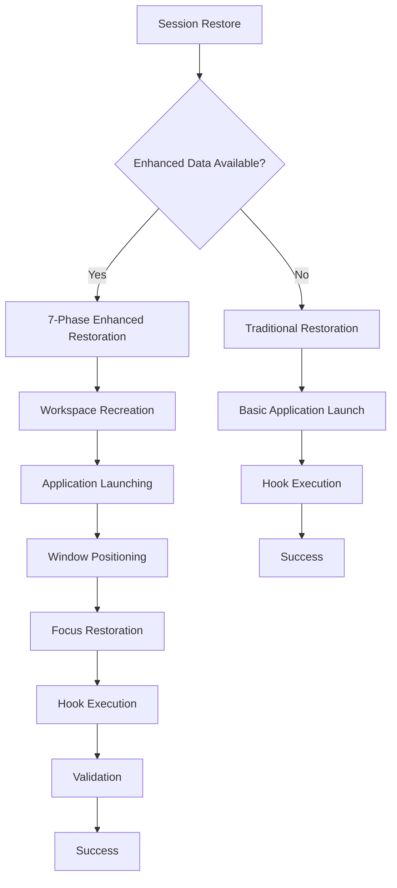

# 🚀 Hyprland Session Manager

A comprehensive session management system for Hyprland that preserves your entire desktop state across reboots. Save and restore window layouts, application sessions, **workspace configurations**, and **quantum state persistence** with intelligent application-specific hooks and advanced state management capabilities.


## ✨ Features

### 🎯 Quantum State Management (NEW!)
- **🚀 Quantum State Persistence**: Advanced state management with comprehensive desktop state capture and restoration
- **🔍 Real-Time Monitoring**: Continuous state monitoring with automatic save triggers
- **🎯 Application Context Recovery**: Complete application session data including browser tabs, terminal environments, and IDE workspaces
- **🔄 Monitor & Workspace Restoration**: Precise multi-monitor layout and workspace arrangement restoration
- **⚡ Performance Optimization**: Intelligent state compression and optimization for large desktop states
- **🛡️ Backward Compatibility**: Seamless migration from legacy session formats with automatic detection

### 🎯 Comprehensive Application Support (15+ Applications)
- **🌐 Cross-Browser Support**: Firefox, Chrome/Chromium, and Thorium session restoration with tabs, profiles, and window positions
- **💬 Messaging Integration**: Discord, Slack, Telegram, and Signal chat state preservation
- **💻 IDEs**: VSCode and Void IDE workspace and project state preservation
- **🖥️ Terminals**: Kitty and Terminator session and layout restoration
- **📝 Note Taking**: Obsidian vault and session management
- **🎨 Creative Apps**: Krita document recovery and window layouts
- **📄 Office Tools**: LibreOffice document session management
- **📁 File Managers**: Dolphin directory state preservation

### 🎯 Workspace-Based Session Management
- **🏗️ Complete Workspace Layout Preservation**: Save and restore entire workspace structures including names, window arrangements, and monitor assignments
- **🎯 Accurate Window Positioning**: Restore windows to their exact positions, sizes, and states (floating, fullscreen, pinned)
- **🚀 Workspace-Aware Application Launching**: Applications automatically launch into their correct workspaces
- **🎯 Intelligent Workspace Focus Restoration**: Return to the exact workspace you were using before shutdown
- **🔄 Automatic Enhanced Session Detection**: Seamlessly works with both traditional and enhanced session data

### 🔧 Advanced Session Management
- **Window State Capture**: Complete workspace layouts and window positions with enhanced workspace data
- **Application-Specific Hooks**: Intelligent state preservation for each app type with workspace integration
- **Hyprland Integration**: Native `hyprctl` commands for accurate state management and workspace control
- **Systemd Service**: Automatic session save/restore on system events
- **ZFS Snapshots**: Filesystem-level session backups (optional)

### 🛡️ Robust Architecture
- **Error Handling**: Graceful degradation when hooks fail with workspace restoration fallbacks
- **Comprehensive Logging**: Detailed logs for debugging workspace restoration
- **State Validation**: Verification of saved session integrity including workspace layouts
- **Modular Design**: Easy to extend with custom hooks and workspace-aware enhancements
- **Backward Compatibility**: Automatic fallback to traditional restoration when enhanced data is unavailable

## 📦 Installation

### Prerequisites
- **Hyprland** (with `hyprctl` available)
- **Zsh** shell
- **jq** for JSON processing
- **Python 3.8+** (for Quantum State Manager)
- **Optional**: ZFS filesystem for snapshots

### Quick Install
```bash
# Clone the repository
git clone https://github.com/yourusername/hyprland-session-manager.git
cd hyprland-session-manager

# Run installation script (includes quantum state setup)
./install.sh

# Verify quantum state installation
python quantum-state-manager.py --capture --save
```

### Quantum State Manager Installation
The Quantum State Manager requires Python 3.8+ and additional dependencies:

```bash
# Install Python dependencies
pip install psutil pyyaml

# Test quantum state functionality
python quantum-state-manager.py --capture --save
python quantum-state-manager.py --load --restore
```

### For Contributors
Want to add hooks for your favorite applications?
```bash
# Validate your hooks before submitting
./validate-hook.sh

# Test your hooks
./community-hooks/pre-save/your-app.sh pre-save
./community-hooks/post-restore/your-app.sh post-restore

# Test quantum state integration
python test-quantum-state-manager.py --quick
```

### Manual Installation
```bash
# Copy files to config directory
cp -r .config/hyprland-session-manager ~/.config/

# Make scripts executable
chmod +x ~/.config/hyprland-session-manager/*.sh
chmod +x ~/.config/hyprland-session-manager/hooks/pre-save/*.sh
chmod +x ~/.config/hyprland-session-manager/hooks/post-restore/*.sh

# Install quantum state manager
cp quantum-state-manager.py ~/.config/hyprland-session-manager/
cp quantum-state-config.py ~/.config/hyprland-session-manager/

# Add keybindings to your Hyprland config
echo "# Session Manager Keybindings" >> ~/.config/hypr/hyprland.conf
echo "bind = SUPER SHIFT, S, exec, ~/.config/hyprland-session-manager/session-manager.sh save" >> ~/.config/hypr/hyprland.conf
echo "bind = SUPER SHIFT, R, exec, ~/.config/hyprland-session-manager/session-manager.sh restore" >> ~/.config/hypr/hyprland.conf
echo "bind = SUPER SHIFT, C, exec, ~/.config/hyprland-session-manager/session-manager.sh clean" >> ~/.config/hypr/hyprland.conf
echo "bind = SUPER SHIFT, Q, exec, python ~/.config/hyprland-session-manager/quantum-state-manager.py --capture --save" >> ~/.config/hypr/hyprland.conf
```

## 🎮 Usage

### Basic Commands
```bash
# Save current session (legacy system)
~/.config/hyprland-session-manager/session-manager.sh save

# Restore saved session (legacy system)
~/.config/hyprland-session-manager/session-manager.sh restore

# Clean session state
~/.config/hyprland-session-manager/session-manager.sh clean

# Check session status
~/.config/hyprland-session-manager/session-manager.sh status
```

### Quantum State Commands (NEW!)
```bash
# Capture and save quantum state
python ~/.config/hyprland-session-manager/quantum-state-manager.py --capture --save

# Load and restore quantum state
python ~/.config/hyprland-session-manager/quantum-state-manager.py --load --restore

# Start auto-save daemon
python ~/.config/hyprland-session-manager/quantum-state-manager.py --auto-save

# Validate state compatibility
python ~/.config/hyprland-session-manager/quantum-state-manager.py --validate

# Migrate legacy sessions
python ~/.config/hyprland-session-manager/quantum-state-manager.py --migrate-legacy ~/.config/hyprland-session-manager/session-state
```

### Keybindings (Recommended)
- **`SUPER SHIFT + S`**: Save session (legacy)
- **`SUPER SHIFT + R`**: Restore session (legacy)
- **`SUPER SHIFT + C`**: Clean session state
- **`SUPER SHIFT + Q`**: Save quantum state (NEW!)

### Systemd Integration
Enable automatic session management:
```bash
# Enable systemd service (legacy)
systemctl --user enable hyprland-session.service
systemctl --user start hyprland-session.service

# Enable quantum state auto-save (NEW!)
systemctl --user enable quantum-state-auto-save.service
systemctl --user start quantum-state-auto-save.service
```

### Quantum State Auto-Save Configuration
Configure automatic quantum state saving:
```bash
# Edit quantum state configuration
python ~/.config/hyprland-session-manager/quantum-state-config.py

# Set auto-save interval (default: 300 seconds)
export QUANTUM_AUTO_SAVE_INTERVAL=600

# Enable/disable state validation
export QUANTUM_STATE_VALIDATION=true
```

## 🔧 Configuration

### Quantum State Configuration (NEW!)
The Quantum State Manager provides comprehensive configuration through multiple sources:

```bash
# View current quantum configuration
python ~/.config/hyprland-session-manager/quantum-state-config.py

# Edit configuration file
nano ~/.config/hyprland-session-manager/quantum-state-config.json

# Environment variable configuration
export QUANTUM_AUTO_SAVE_INTERVAL=600
export QUANTUM_STATE_VALIDATION=true
export QUANTUM_BROWSERS_ENABLED=true
export QUANTUM_TERMINALS_ENABLED=true
```

### Configuration Categories
- **Core Settings**: Auto-save intervals, validation levels, session management
- **Application Contexts**: Browser, terminal, IDE, and creative app tracking
- **Monitor & Workspace**: Layout capture, window state tracking
- **Performance**: Memory limits, compression, optimization settings
- **Backup & Validation**: Backup policies, validation procedures
- **Integration**: Hyprland integration, backward compatibility

### Application Hooks with Quantum State Integration
Session manager includes pre-configured hooks for 15+ applications with enhanced workspace and quantum state support:

| Application     | Pre-Save Hook | Post-Restore Hook | Data Preserved                            | Workspace Support                       | Quantum State Support                  |
| --------------- | ------------- | ----------------- | ----------------------------------------- | --------------------------------------- | -------------------------------------- |
| Firefox         | ✅             | ✅                 | Tabs, session, window positions           | ✅ Enhanced workspace assignment         | ✅ Browser session capture             |
| Chrome/Chromium | ✅             | ✅                 | Tabs, profiles, window positions          | ✅ Enhanced workspace assignment         | ✅ Browser session capture             |
| Thorium Browser | ✅             | ✅                 | Tabs, profiles, window positions          | ✅ Enhanced workspace assignment         | ✅ Browser session capture             |
| VSCode          | ✅             | ✅                 | Workspace, projects, layouts              | ✅ Enhanced workspace assignment         | ✅ IDE workspace capture               |
| Void IDE        | ✅             | ✅                 | Workspace, projects, layouts              | ✅ Enhanced workspace assignment         | ✅ IDE workspace capture               |
| Kitty           | ✅             | ✅                 | Terminal sessions, layouts                | ✅ Enhanced workspace assignment*        | ✅ Terminal environment tracking       |
| Terminator      | ✅             | ✅                 | Window layouts, sessions                  | ✅ Enhanced workspace assignment         | ✅ Terminal environment tracking       |
| Discord         | ✅             | ✅                 | Server/channel state, window positions    | ✅ Enhanced workspace assignment         | ✅ Application context capture         |
| Slack           | ✅             | ✅                 | Workspace/channel state, window positions | ✅ Enhanced workspace assignment         | ✅ Application context capture         |
| Telegram        | ✅             | ✅                 | Chat sessions, window positions           | ✅ Enhanced workspace assignment         | ✅ Application context capture         |
| Signal          | ✅             | ✅                 | Conversation state, window positions      | ✅ Enhanced workspace assignment         | ✅ Application context capture         |
| Obsidian        | ✅             | ✅                 | Vault sessions, note state                | ✅ Enhanced workspace assignment         | ✅ Application context capture         |
| Krita           | ✅             | ✅                 | Documents, recovery files                 | ✅ Enhanced workspace assignment         | ✅ Creative app session capture        |
| LibreOffice     | ✅             | ✅                 | Open documents, window state              | ✅ Enhanced workspace assignment         | ✅ Document session capture            |
| Dolphin         | ✅             | ✅                 | Directory state, window layout            | ✅ Enhanced workspace assignment         | ✅ File manager context capture        |

*Kitty terminal session restoration has limitations with complex terminal sessions, but workspace assignment works reliably

### Custom Hooks with Quantum State Support
Add your own application hooks with workspace and quantum state integration:

1. **Create pre-save hook**:
```bash
# ~/.config/hyprland-session-manager/hooks/pre-save/my-app.sh
#!/usr/bin/env zsh
# Your pre-save logic here
# Workspace data is automatically captured by the main system
# Quantum state data is captured by the quantum state manager
```

2. **Create post-restore hook**:
```bash
# ~/.config/hyprland-session-manager/hooks/post-restore/my-app.sh
#!/usr/bin/env zsh
# Your post-restore logic here
# Workspace assignment is handled by the main restoration system
# Quantum state restoration is handled by the quantum state manager
```

3. **Make executable**:
```bash
chmod +x ~/.config/hyprland-session-manager/hooks/*/my-app.sh
```

### Quantum State Integration in Hooks
When creating new hooks, you can leverage quantum state data:

```bash
# Check if quantum state data exists
if [[ -f "${SESSION_STATE_DIR}/quantum-state/quantum_state_*.json" ]]; then
    local quantum_state=$(find "${SESSION_STATE_DIR}/quantum-state" -name "quantum_state_*.json" | head -1)
    if [[ -n "$quantum_state" ]]; then
        local app_context=$(jq -r ".application_contexts[] | select(.class == \"$app_class\")" "$quantum_state")
        log_info "Found quantum state context for $app_class"
    fi
fi

# Check if enhanced workspace data exists
if [[ -f "${SESSION_STATE_DIR}/application_workspace_mapping.json" ]]; then
    local workspace=$(jq -r ".[] | select(.class == \"$app_class\") | .workspace" "${SESSION_STATE_DIR}/application_workspace_mapping.json")
    log_info "Application $app_class assigned to workspace $workspace"
fi
```

See [workspace-restoration-hooks-guide.md](workspace-restoration-hooks-guide.md) and [quantum-state-user-guide.md](quantum-state-user-guide.md) for detailed integration guidance.

## 📊 Application Support Matrix

### Fully Supported Applications (15 Total) with Enhanced Workspace Support
- **Firefox**: Complete session restoration with tabs, positions, and workspace assignment
- **Chrome/Chromium**: Tab sessions, profiles, window positions, and workspace assignment
- **Thorium Browser**: Full session restoration with tabs, profiles, and workspace assignment
- **VSCode**: Workspace state, project recovery, and enhanced workspace assignment
- **Void IDE**: Window layouts, project state, and enhanced workspace assignment
- **Kitty**: Terminal sessions, layouts, and workspace assignment (basic session support with limitations)
- **Terminator**: Window layouts, session management, and workspace assignment
- **Discord**: Server/channel state, window positions, and workspace assignment
- **Slack**: Workspace/channel state, window positions, and workspace assignment
- **Telegram**: Chat session preservation, window positions, and workspace assignment
- **Signal**: Conversation state management, window positions, and workspace assignment
- **Obsidian**: Vault sessions, note state preservation, and workspace assignment
- **Krita**: Document recovery, window positions, and workspace assignment
- **LibreOffice**: Open documents, window state, and workspace assignment
- **Dolphin**: Directory state, window positions, and workspace assignment

### Enhanced Workspace Support Benefits
- ✅ **Automatic Workspace Assignment**: Applications launch into correct workspaces
- ✅ **Window Position Accuracy**: Precise restoration of window positions and sizes
- ✅ **State Preservation**: Floating, fullscreen, and pinned window states maintained
- ✅ **Focus Management**: Active workspace focus restoration
- ✅ **Multi-Monitor Support**: Workspace configurations across multiple monitors

### Basic Support (Window State Only)
- Any application with proper window class detection
- Generic window position and workspace restoration
- Automatic workspace assignment when enhanced data is available

### Known Limitations
- **Kitty Terminal**: Complex terminal sessions may not restore completely, but workspace assignment works reliably
- **Application-specific data**: Some applications may require manual configuration restoration
- **Workspace Conflicts**: Rare conflicts with existing workspace IDs are automatically resolved

## 🐛 Troubleshooting

### Common Issues

**Session not saving properly:**
- Check if `hyprctl` is available and working
- Verify all scripts have executable permissions
- Check logs in `~/.config/hyprland-session-manager/session-state/`

**Applications not restoring to correct workspaces:**
- Ensure enhanced session data exists (check for `workspace_layouts.json`)
- Verify application-specific hooks are executable
- Check if applications are installed in PATH
- Verify window class names match (use `hyprctl clients`)

**Workspace restoration issues:**
- Check if workspace data was captured (look for enhanced session files)
- Verify Hyprland workspace creation permissions
- Check for workspace ID conflicts in complex configurations

**Systemd service not starting:**
- Check user systemd service status: `systemctl --user status hyprland-session`
- Verify environment variables are set correctly
- Check journal logs: `journalctl --user-unit=hyprland-session`

### Quantum State Troubleshooting (NEW!)

**Quantum state capture failing:**
- Verify Python 3.8+ is installed: `python3 --version`
- Check Python dependencies: `pip list | grep -E "(psutil|pyyaml)"`
- Ensure quantum state manager has write permissions: `ls -la ~/.config/hyprland-session-manager/quantum-state/`

**Quantum state validation errors:**
- Check state compatibility: `python quantum-state-manager.py --validate`
- Verify quantum state files exist: `ls -la ~/.config/hyprland-session-manager/quantum-state/`
- Check for corrupted state files: `python quantum-state-manager.py --load --restore`

**Auto-save not working:**
- Verify auto-save configuration: `python quantum-state-config.py`
- Check quantum state logs: `tail -f /tmp/quantum-state-manager.log`
- Ensure quantum state auto-save service is running: `systemctl --user status quantum-state-auto-save`

### Enhanced Session Data Verification
Check if enhanced workspace data is available:
```bash
# Check for enhanced session files
ls -la ~/.config/hyprland-session-manager/session-state/ | grep -E "(workspace_layouts|window_states|application_workspace_mapping)"

# Verify workspace data integrity
jq '.' ~/.config/hyprland-session-manager/session-state/workspace_layouts.json

# Check quantum state files (NEW!)
ls -la ~/.config/hyprland-session-manager/quantum-state/
jq '.session_id' ~/.config/hyprland-session-manager/quantum-state/quantum_state_*.json | head -1
```

### Debug Mode
Enable detailed logging for workspace restoration:
```bash
export HYPRLAND_SESSION_DEBUG=1
~/.config/hyprland-session-manager/session-manager.sh save
~/.config/hyprland-session-manager/session-manager.sh restore
```

Enable quantum state debugging:
```bash
# Enable quantum state debug logging
export QUANTUM_DEBUG=1
python ~/.config/hyprland-session-manager/quantum-state-manager.py --capture --save

# Check quantum state logs
tail -f /tmp/quantum-state-manager.log
```

Check restoration logs for workspace recreation phases and application workspace assignments.

## 🔄 How It Works

### Enhanced Session Save Process
1. **Workspace Layout Capture**: Extracts complete workspace configurations including names, window arrangements, and monitor assignments
2. **Window State Capture**: Saves detailed window positions, sizes, and states (floating, fullscreen, pinned)
3. **Application-Workspace Mapping**: Creates intelligent mappings linking applications to their target workspaces
4. **Application Hooks**: Runs pre-save hooks for each detected application type
5. **State Serialization**: Saves enhanced session data to session state directory
6. **Metadata Creation**: Generates comprehensive session summaries and logs

### Enhanced Session Restore Process
The system automatically detects enhanced session data and uses a sophisticated 7-phase restoration workflow:



**Enhanced 7-Phase Restoration:**
1. **Workspace Recreation**: Recreates all workspaces with their original names and configurations
2. **Workspace-Aware Application Launching**: Launches applications directly to their assigned workspaces
3. **Application Initialization Wait**: Allows applications to fully initialize before positioning
4. **Window Positioning**: Restores windows to their exact positions, sizes, and states
5. **Workspace Focus Restoration**: Returns focus to the previously active workspace
6. **Post-Restore Hooks**: Executes application-specific restoration hooks
7. **Validation**: Verifies restoration success and logs comprehensive results

**Traditional Restoration (Fallback):**
- Basic application launching to current workspace
- Application-specific hook execution
- Maintains compatibility with older session data

## 🎯 Workspace Restoration Benefits

### Perfect Desktop Persistence
Experience true desktop continuity with workspace-based session management:

- **🔁 Exact Workspace Recreation**: Return to your exact workspace layouts after reboot
- **🎯 Window Position Accuracy**: Applications restore to their precise positions and sizes
- **🚀 Context-Aware Launching**: Applications automatically open in their correct workspaces
- **🎯 Focus Preservation**: Return to the workspace you were actively using

### Real-World Use Cases
- **Development Workflow**: VSCode in workspace 1, terminals in workspace 2, browser in workspace 3
- **Creative Work**: Krita in workspace 1, reference images in workspace 2, communication apps in workspace 3
- **Office Setup**: LibreOffice in workspace 1, browser in workspace 2, file manager in workspace 3
- **Multi-Monitor Configurations**: Complex workspace arrangements across multiple monitors

### Enhanced Session Data
The system creates comprehensive session files for optimal restoration:

- **`workspace_layouts.json`**: Complete workspace configurations and structures
- **`window_states.json`**: Detailed window positions, sizes, and state information
- **`application_workspace_mapping.json`**: Intelligent application-to-workspace assignments

### Backward Compatibility
- **🔄 Automatic Detection**: System automatically detects and uses enhanced session data when available
- **🛡️ Graceful Fallback**: Falls back to traditional restoration when enhanced data is unavailable
- **📈 Seamless Upgrade**: Existing users automatically benefit from enhanced features
- **🔧 No Configuration Changes**: Works out-of-the-box with existing setups

## 🤝 Community Contributions

**We actively welcome community hooks!** 🎉

### 🚀 Submit Your Application Hooks
Got a custom session save/restore script for your favorite app? **We want it!**

1. **Create hooks** using our [hook template](examples/custom-hook-example.sh)
2. **Place them** in the [community-hooks](community-hooks/) directory
3. **Validate** with `./validate-hook.sh`
4. **Submit PR** - we'll merge quality hooks into the main project!

### 🏆 Featured Community Hooks
- **🌐 Chrome/Chromium**: Complete session restoration with tabs, profiles, and window positions
- **🌐 Thorium Browser**: Full session restoration with tabs and profiles
- **💬 Discord**: Server/channel state preservation and window positioning
- **💬 Slack**: Workspace/channel state management and session recovery
- **💬 Telegram**: Chat session preservation and conversation state
- **💬 Signal**: Conversation state management and chat sessions
- **🖥️ Kitty**: Terminal session and layout restoration (basic support with limitations)
- **🖥️ Terminator**: Window layouts and session management
- **📝 Obsidian**: Vault sessions and note state preservation
- **💻 Void IDE**: Workspace and project state preservation

*Your hooks could be featured here!* Submit your PR and help others.

### 🤝 Contributing Guidelines
See [CONTRIBUTING.md](CONTRIBUTING.md) for detailed contribution guidelines.

#### Adding New Application Support
1. Create pre-save and post-restore hooks
2. Test with the actual application
3. Update documentation
4. Submit pull request

#### Reporting Issues
Please include:
- Hyprland version
- Application details
- Session manager logs
- Steps to reproduce
- Workspace configuration details (for enhanced restoration issues)

## 📄 License

This project is licensed under the MIT License - see the [LICENSE](LICENSE) file for details.

## 🙏 Acknowledgments

### 🏆 Core Contributors
- **[Your Name]** - Project creator and maintainer

### 🤝 Community Hook Contributors
- **[Community Contributor]** - Chrome/Chromium session hooks
- **[Community Contributor]** - Discord workspace hooks
- **[Community Contributor]** - Slack channel hooks
- **[Hyprland Session Manager Team]** - Thorium, Kitty, Terminator, Telegram, Signal, Void IDE, Obsidian hooks

*Submit your first hook PR to be featured here!*

### 💖 Special Thanks
- **Hyprland Team** for the amazing compositor
- **Hyprland Community** for plugin examples and inspiration
- **All Contributors** who help improve this project

---

**Made with ❤️ for the Hyprland community**

*If this project helps you, please consider giving it a ⭐ on GitHub and submitting your application hooks!*