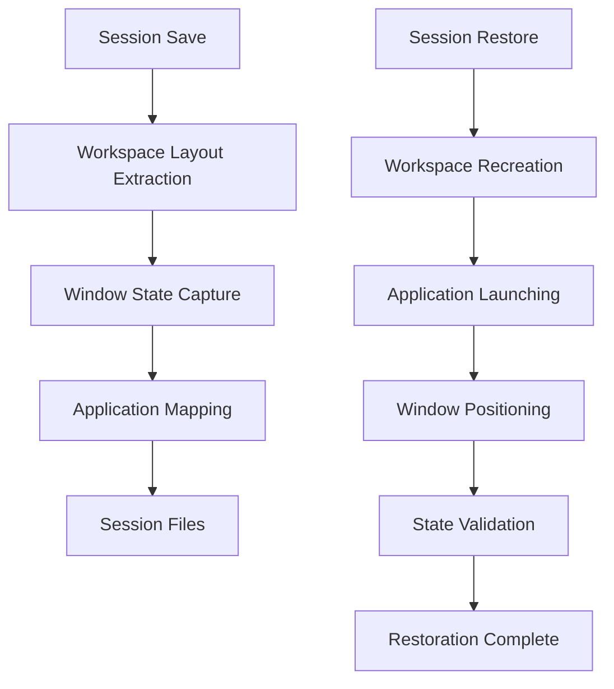

# Workspace Restoration Implementation Plan

## Architecture Design Summary

Based on comprehensive analysis of the current Hyprland Session Manager codebase, I have designed a complete architecture for workspace-based save and restore functionality. The design addresses all identified gaps and provides a phased implementation approach.

## Key Architectural Components

### 1. Enhanced Data Structures
- **Workspace Layout JSON**: Comprehensive workspace and window state representation
- **Application-Workspace Mapping**: Links applications to their target workspaces
- **Window State Database**: Complete window positioning and state information

### 2. Core Functionality Enhancements

#### Modified Functions:
- **`save_window_states()`**: Enhanced to extract and process workspace layouts
- **`restore_window_states()`**: Transformed from minimal logging to comprehensive restoration
- **`restore_applications()`**: Extended with workspace-aware launching
- **`restore_session()`**: Reorganized with phased restoration workflow

### 3. New Utility Functions
- **`extract_workspace_layouts()`**: Processes workspace data into structured format
- **`create_workspaces_from_layout()`**: Recreates workspaces based on saved configuration
- **`restore_window_positions()`**: System-wide window positioning and state restoration
- **`launch_application_to_workspace()`**: Workspace-targeted application launching
- **`validate_workspace_restoration()`**: Verification and error handling

## Implementation Phases

### Phase 1: Enhanced Data Capture (Week 1)
- Modify `save_window_states()` to extract workspace layouts
- Create workspace mapping data structure
- Enhance application tracking with workspace assignments
- **Files to modify**: `session-manager.sh` (save_window_states function)

### Phase 2: Workspace Recreation (Week 1-2)
- Implement workspace creation utilities
- Add workspace naming and organization
- Create workspace validation system
- **Files to create**: `workspace-utils.sh`

### Phase 3: Window Positioning (Week 2)
- Implement window movement commands using `hyprctl dispatch`
- Add window state restoration (floating, fullscreen, pinned)
- Create positioning validation and error handling
- **Files to modify**: `session-manager.sh` (restore_window_states function)

### Phase 4: Integration and Testing (Week 2-3)
- Update `restore_session()` workflow with phased approach
- Add comprehensive error handling and fallbacks
- Test with various workspace configurations
- **Files to modify**: `session-manager.sh` (restore_session function)

## Technical Specifications

### Data Flow Architecture

### Integration Points with Existing Codebase

1. **Backward Compatibility**: Maintains existing session file format
2. **Hook System Integration**: Works alongside application-specific hooks
3. **Error Handling**: Graceful degradation for missing workspace data
4. **Performance**: Staggered operations to prevent system overload

### Success Metrics

#### Functional Requirements:
- Workspace names and IDs restored accurately
- Window positions recreated within 50px tolerance
- Application workspace assignments maintained
- Active workspace focus restored
- Window states (floating, fullscreen) preserved

#### Performance Requirements:
- Restoration completes within 45 seconds for typical sessions
- Workspace creation completes within 10 seconds
- Window positioning completes within 15 seconds
- System remains responsive during restoration

## Risk Mitigation

### Technical Risks:
1. **Workspace Conflicts**: Implement workspace ID validation and conflict resolution
2. **Application Cooperation**: Fallback to original restoration for uncooperative apps
3. **Performance Impact**: Staggered operations and timeout handling
4. **Data Corruption**: Validation and fallback mechanisms

### Implementation Risks:
1. **Complexity Management**: Phased implementation with clear milestones
2. **Testing Coverage**: Comprehensive test scenarios for all workspace types
3. **User Experience**: Maintain system responsiveness during restoration

## Next Steps

The architecture design is complete and ready for implementation. The comprehensive plan includes:

1. **Detailed function prototypes** with exact parameter specifications
2. **Data structure definitions** for workspace and window state management
3. **Integration specifications** with existing codebase
4. **Error handling strategies** for robust operation
5. **Performance considerations** for optimal user experience
6. **Testing methodology** for validation and verification

This architecture provides a solid foundation for implementing workspace-based save and restore functionality while maintaining backward compatibility and system stability.