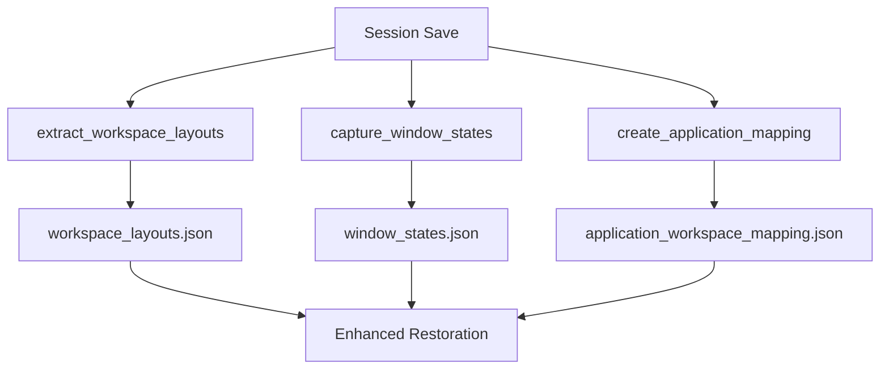
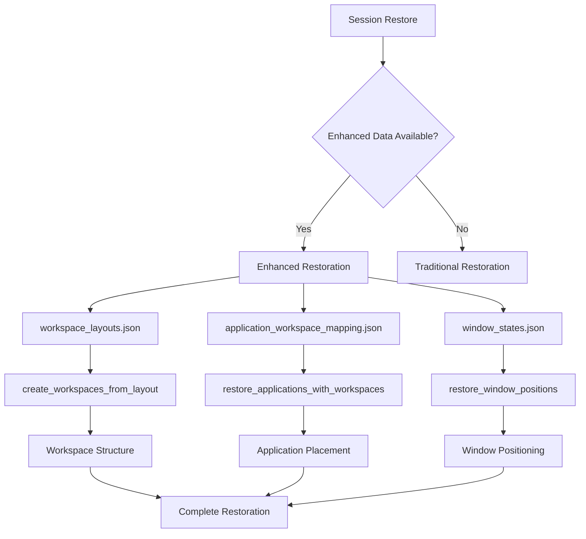

# Enhanced Session File Formats

## Overview

This document describes the enhanced session file formats used by the workspace-based save and restore functionality. These files provide comprehensive workspace and window state information for optimal session restoration.

## 📁 Enhanced Session Data Files

### `workspace_layouts.json`

**Purpose**: Stores complete workspace configurations and structures

**Location**: `~/.config/hyprland-session-manager/session-state/workspace_layouts.json`

**Format**:
```json
[
  {
    "id": 1,
    "name": "main",
    "monitor": "DP-1",
    "monitorID": 0,
    "windows": 3,
    "hasfullscreen": false
  },
  {
    "id": 2,
    "name": "web",
    "monitor": "DP-1",
    "monitorID": 0,
    "windows": 2,
    "hasfullscreen": false
  }
]
```

**Fields**:
- `id`: Workspace ID number
- `name`: Workspace name (if assigned)
- `monitor`: Monitor name the workspace is assigned to
- `monitorID`: Monitor ID number
- `windows`: Number of windows in the workspace
- `hasfullscreen`: Whether any window is in fullscreen mode

**Usage**: Used by `create_workspaces_from_layout()` to recreate workspace structures

---

### `window_states.json`

**Purpose**: Stores detailed window positions, sizes, and state information

**Location**: `~/.config/hyprland-session-manager/session-state/window_states.json`

**Format**:
```json
[
  {
    "address": "0x12345678",
    "class": "firefox",
    "title": "Mozilla Firefox",
    "workspace": {
      "id": 1,
      "name": "main"
    },
    "at": [100, 50],
    "size": [1200, 800],
    "floating": false,
    "fullscreen": false,
    "pinned": false,
    "monitor": "DP-1",
    "monitorID": 0,
    "focused": false
  }
]
```

**Fields**:
- `address`: Unique window identifier
- `class`: Application window class
- `title`: Window title
- `workspace`: Workspace assignment with ID and name
- `at`: Window position [x, y] coordinates
- `size`: Window size [width, height]
- `floating`: Whether window is floating
- `fullscreen`: Whether window is fullscreen
- `pinned`: Whether window is pinned
- `monitor`: Monitor assignment
- `monitorID`: Monitor ID number
- `focused`: Whether window has focus

**Usage**: Used by `restore_window_positions()` for accurate window positioning

---

### `application_workspace_mapping.json`

**Purpose**: Maps applications to their target workspaces for intelligent launching

**Location**: `~/.config/hyprland-session-manager/session-state/application_workspace_mapping.json`

**Format**:
```json
[
  {
    "class": "firefox",
    "workspace": 1,
    "title": "Mozilla Firefox",
    "command": "firefox"
  },
  {
    "class": "code",
    "workspace": 2,
    "title": "Visual Studio Code",
    "command": "code"
  }
]
```

**Fields**:
- `class`: Application window class
- `workspace`: Target workspace ID
- `title`: Window title (for reference)
- `command`: Application launch command

**Usage**: Used by `restore_applications_with_workspaces()` for workspace-aware application launching

---

## 🔄 Traditional Session Files (Backward Compatibility)

### `workspaces.json`

**Purpose**: Basic workspace information (traditional format)

**Location**: `~/.config/hyprland-session-manager/session-state/workspaces.json`

**Usage**: Fallback data for traditional restoration

### `clients.json`

**Purpose**: Basic client/window information (traditional format)

**Location**: `~/.config/hyprland-session-manager/session-state/clients.json`

**Usage**: Fallback data for traditional restoration

### `applications.txt`

**Purpose**: Simple application list (traditional format)

**Location**: `~/.config/hyprland-session-manager/session-state/applications.txt`

**Format**:
```
1234:firefox:Mozilla Firefox
5678:code:Visual Studio Code
```

**Usage**: Fallback data for traditional application restoration

---

## 🎯 Enhanced Data Capture Process

### Data Extraction Flow



### File Generation Functions

1. **`extract_workspace_layouts()`** (lines 111-139 in `session-manager.sh`)
   - Extracts workspace configurations using `hyprctl workspaces -j`
   - Processes data with `jq` for structured output
   - Creates `workspace_layouts.json`

2. **`capture_window_states()`** (lines 142-179 in `session-manager.sh`)
   - Captures detailed window information using `hyprctl clients -j`
   - Includes positions, sizes, states, and workspace assignments
   - Creates `window_states.json`

3. **`create_application_mapping()`** (lines 182-209 in `session-manager.sh`)
   - Maps applications to workspaces using window class detection
   - Creates unique mappings for workspace-aware launching
   - Creates `application_workspace_mapping.json`

---

## 🔧 Data Validation and Integrity

### File Validation Commands

```bash
# Validate workspace layouts
jq '.' ~/.config/hyprland-session-manager/session-state/workspace_layouts.json

# Validate window states
jq '.' ~/.config/hyprland-session-manager/session-state/window_states.json

# Validate application mappings
jq '.' ~/.config/hyprland-session-manager/session-state/application_workspace_mapping.json

# Check file sizes and timestamps
ls -la ~/.config/hyprland-session-manager/session-state/ | grep -E "(workspace_layouts|window_states|application_workspace_mapping)"
```

### Data Integrity Checks

- **Workspace ID Validation**: Ensures workspace IDs are valid and unique
- **Window Address Validation**: Confirms window addresses are properly formatted
- **Application Class Validation**: Verifies application classes match known patterns
- **JSON Schema Validation**: Ensures all JSON files follow expected structures

---

## 🚀 Restoration Data Flow

### Enhanced Restoration Process



### Data Usage by Function

- **`create_workspaces_from_layout()`**: Uses `workspace_layouts.json` for workspace recreation
- **`restore_applications_with_workspaces()`**: Uses `application_workspace_mapping.json` for workspace-aware launching
- **`restore_window_positions()`**: Uses `window_states.json` for window positioning
- **`validate_workspace_restoration()`**: Uses both saved and current workspace data for validation

---

## 📊 File Size and Performance

### Typical File Sizes

- **`workspace_layouts.json`**: 1-5 KB (depending on number of workspaces)
- **`window_states.json`**: 5-20 KB (depending on number of windows)
- **`application_workspace_mapping.json`**: 1-3 KB (depending on number of applications)

### Performance Impact

- **Save Operations**: Minimal impact - JSON parsing and file writing
- **Restore Operations**: Efficient data loading and processing
- **Memory Usage**: Low memory footprint during data processing

---

## 🔄 Migration and Compatibility

### Automatic Detection

The system automatically detects enhanced session data:

```bash
# Enhanced data detection in restore_session() function
if [[ -f "$workspace_layout" && -f "$window_states" && -f "$app_mapping" ]]; then
    log_info "Enhanced workspace data found - using advanced restoration"
    # Use enhanced restoration
else
    log_info "Enhanced workspace data not found - using basic restoration"
    # Use traditional restoration
fi
```

### Backward Compatibility

- **Traditional Files**: Always created alongside enhanced files
- **Fallback Mechanism**: Automatic fallback to traditional restoration
- **No Data Loss**: Traditional session data preserved for compatibility
- **Seamless Upgrade**: Existing users automatically benefit from enhanced features

---

## 🛠️ Troubleshooting File Issues

### Common File Problems

**Missing Enhanced Files:**
- Check if enhanced features are enabled in the session manager
- Verify `hyprctl` and `jq` dependencies are installed
- Check file permissions in session state directory

**Corrupted JSON Files:**
- Use `jq` to validate JSON syntax
- Check for incomplete file writes during session save
- Verify sufficient disk space

**Workspace ID Conflicts:**
- Check for duplicate workspace IDs in `workspace_layouts.json`
- Verify workspace ID ranges are valid
- Ensure workspace names are properly escaped

### Debug Commands

```bash
# Check enhanced file existence and integrity
enhanced_files_exist() {
    local state_dir="$HOME/.config/hyprland-session-manager/session-state"
    local files=("workspace_layouts.json" "window_states.json" "application_workspace_mapping.json")
    
    for file in "${files[@]}"; do
        if [[ -f "$state_dir/$file" ]]; then
            echo "✅ $file exists"
            if jq '.' "$state_dir/$file" > /dev/null 2>&1; then
                echo "   ✅ Valid JSON"
            else
                echo "   ❌ Invalid JSON"
            fi
        else
            echo "❌ $file missing"
        fi
    done
}
```

---

## 📝 Conclusion

The enhanced session file formats provide comprehensive workspace and window state information for optimal session restoration. The system maintains full backward compatibility while offering significant improvements in restoration accuracy and user experience.

For detailed implementation information, refer to the enhanced functions in [`session-manager.sh`](.config/hyprland-session-manager/session-manager.sh).

For user guidance, see [workspace-restoration-user-guide.md](workspace-restoration-user-guide.md).