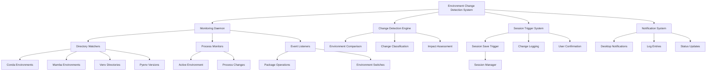

# Environment Change Detection Mechanism - Complete Design Specification

## Executive Summary

This document provides a comprehensive design for an environment change detection mechanism that enhances the Hyprland Session Manager with proactive monitoring of development environment changes. The system automatically detects when environments are created, modified, or destroyed and triggers automatic session saving to maintain session integrity.

## Architecture Overview

### System Components



## Core Implementation Components

### 1. Monitoring Daemon

**File:** `environment-monitor-daemon.sh`

```bash
#!/usr/bin/env bash
# Environment Monitoring Daemon for Hyprland Session Manager

# Configuration
MONITOR_INTERVAL=60
CHANGE_THRESHOLD=2
NOTIFICATION_ENABLED=true
AUTO_SAVE_ENABLED=true

# Main monitoring loop
main_monitoring_loop() {
    log_info "Starting environment monitoring daemon"
    
    # Initialize monitoring
    initialize_monitoring
    establish_baseline
    
    # Main monitoring loop
    while true; do
        # Real-time directory monitoring
        monitor_environment_directories
        
        # Periodic full environment scan
        perform_periodic_scan
        
        # Active environment monitoring
        monitor_active_environment
        
        # Process monitoring
        monitor_package_operations
        
        # Wait for next cycle
        sleep "$MONITOR_INTERVAL"
        
        # Check for termination signal
        if [[ -f "${SESSION_DIR}/stop_monitoring" ]]; then
            log_info "Stopping environment monitoring"
            cleanup_monitoring
            exit 0
        fi
    done
}
```

### 2. Directory Monitoring System

```bash
# Core directory monitoring using inotify
monitor_environment_directories() {
    local watch_dirs=()
    
    # Conda environments
    if command -v conda > /dev/null; then
        local conda_base=$(conda info --base 2>/dev/null)
        if [[ -n "$conda_base" ]]; then
            watch_dirs+=("$conda_base/envs")
        fi
    fi
    
    # Mamba environments
    if command -v mamba > /dev/null; then
        local mamba_base=$(mamba info --base 2>/dev/null)
        if [[ -n "$mamba_base" ]]; then
            watch_dirs+=("$mamba_base/envs")
        fi
    fi
    
    # Virtual environment locations
    watch_dirs+=(
        "$HOME/.virtualenvs"
        "$HOME/venvs"
        "$HOME/.venvs"
    )
    
    # Pyenv versions
    if command -v pyenv > /dev/null; then
        local pyenv_root=$(pyenv root 2>/dev/null)
        if [[ -n "$pyenv_root" ]]; then
            watch_dirs+=("$pyenv_root/versions")
        fi
    fi
    
    # Monitor all identified directories
    for dir in "${watch_dirs[@]}"; do
        if [[ -d "$dir" ]]; then
            monitor_directory "$dir"
        fi
    done
}

# Directory monitoring implementation
monitor_directory() {
    local directory="$1"
    
    # Use inotifywait for real-time monitoring
    inotifywait -m -r -e create,delete,modify,move \
        --format "%w%f %e %T" --timefmt "%Y-%m-%dT%H:%M:%S" \
        "$directory" | while read path event time; do
        
        log_info "Directory change detected: $path - $event at $time"
        handle_directory_change "$path" "$event" "$time"
    done &
    
    local monitor_pid=$!
    echo "$monitor_pid" >> "${SESSION_DIR}/monitor_pids.txt"
}
```

### 3. Change Detection Engine

```bash
# Compare current environment state with baseline
detect_environment_changes() {
    local baseline_file="${SESSION_STATE_DIR}/environment_baseline.json"
    local current_file="${SESSION_STATE_DIR}/environment_current.json"
    
    # Capture current environment state
    capture_environment_snapshot "$current_file"
    
    if [[ ! -f "$baseline_file" ]]; then
        # First run - set baseline
        cp "$current_file" "$baseline_file"
        log_info "Environment baseline established"
        return 0
    fi
    
    # Compare baseline with current state
    local changes=$(compare_environment_states "$baseline_file" "$current_file")
    
    if [[ -n "$changes" ]]; then
        log_info "Environment changes detected: $changes"
        handle_environment_changes "$changes"
        
        # Update baseline
        cp "$current_file" "$baseline_file"
        return 1
    fi
    
    return 0
}

# Compare environment states
compare_environment_states() {
    local baseline="$1"
    local current="$2"
    
    local changes=()
    
    if command -v jq > /dev/null; then
        # Compare environment lists
        local baseline_envs=$(jq -r '.environments[] | "\(.type):\(.name)"' "$baseline" 2>/dev/null | sort)
        local current_envs=$(jq -r '.environments[] | "\(.type):\(.name)"' "$current" 2>/dev/null | sort)
        
        # Detect new environments
        local new_envs=$(comm -13 <(echo "$baseline_envs") <(echo "$current_envs"))
        if [[ -n "$new_envs" ]]; then
            changes+=("new_environments:$new_envs")
        fi
        
        # Detect removed environments
        local removed_envs=$(comm -23 <(echo "$baseline_envs") <(echo "$current_envs"))
        if [[ -n "$removed_envs" ]]; then
            changes+=("removed_environments:$removed_envs")
        fi
    fi
    
    echo "${changes[@]}"
}
```

### 4. Change Classification System

```bash
# Classify and prioritize environment changes
classify_environment_change() {
    local change_type="$1"
    local change_details="$2"
    
    case "$change_type" in
        "environment_created")
            echo "HIGH: New environment created"
            return 2
            ;;
        "environment_deleted")
            echo "HIGH: Environment deleted"
            return 2
            ;;
        "package_installed")
            echo "MEDIUM: Package installation"
            return 1
            ;;
        "package_updated")
            echo "LOW: Package update"
            return 0
            ;;
        "environment_switched")
            echo "INFO: Active environment changed"
            return 0
            ;;
        "configuration_modified")
            echo "MEDIUM: Environment configuration changed"
            return 1
            ;;
        *)
            echo "UNKNOWN: $change_type"
            return 0
            ;;
    esac
}

# Impact assessment for changes
assess_change_impact() {
    local change_type="$1"
    local env_type="$2"
    local env_name="$3"
    
    local impact_score=0
    
    # High impact changes
    case "$change_type" in
        "environment_created"|"environment_deleted")
            impact_score=3
            ;;
        "core_package_change")
            impact_score=2
            ;;
        "dependency_update")
            impact_score=1
            ;;
    esac
    
    # Environment type modifiers
    case "$env_type" in
        "conda"|"mamba")
            impact_score=$((impact_score + 1))
            ;;
        "venv")
            impact_score=$((impact_score + 0))
            ;;
        "pyenv")
            impact_score=$((impact_score + 1))
            ;;
    esac
    
    echo "$impact_score"
}
```

### 5. Automatic Session Saving

```bash
# Trigger automatic session save on environment changes
trigger_automatic_save() {
    local change_type="$1"
    local change_details="$2"
    local impact_score="$3"
    
    if [[ "$AUTO_SAVE_ENABLED" != "true" ]]; then
        log_info "Automatic saving disabled - change detected but not saving"
        return 0
    fi
    
    if [[ "$impact_score" -lt "$CHANGE_THRESHOLD" ]]; then
        log_info "Change impact below threshold ($impact_score < $CHANGE_THRESHOLD) - not saving"
        return 0
    fi
    
    log_info "Triggering automatic session save due to: $change_type"
    
    # Send desktop notification
    if [[ "$NOTIFICATION_ENABLED" == "true" ]]; then
        send_desktop_notification "Environment Change Detected" \
            "Saving session due to: $change_details" \
            "info"
    fi
    
    # Trigger session save
    if [[ -f "${SESSION_DIR}/session-manager.sh" ]]; then
        "${SESSION_DIR}/session-manager.sh" save
        local save_result=$?
        
        if [[ $save_result -eq 0 ]]; then
            log_success "Automatic session save completed successfully"
            send_desktop_notification "Session Saved" \
                "Session automatically saved due to environment changes" \
                "success"
        else
            log_error "Automatic session save failed"
            send_desktop_notification "Session Save Failed" \
                "Failed to automatically save session" \
                "error"
        fi
        
        return $save_result
    else
        log_error "Session manager not found at ${SESSION_DIR}/session-manager.sh"
        return 1
    fi
}
```

### 6. Desktop Notification System

```bash
# Send desktop notifications for environment changes
send_desktop_notification() {
    local title="$1"
    local message="$2"
    local urgency="$3"  # low, normal, critical
    
    if command -v notify-send > /dev/null; then
        notify-send -u "$urgency" -t 5000 \
            "Hyprland Environment Monitor" \
            "$title: $message"
    elif command -v kdialog > /dev/null; then
        kdialog --title "Hyprland Environment Monitor" \
            --msgbox "$title: $message"
    else
        log_info "NOTIFICATION: $title - $message"
    fi
}

# Notification templates
notify_environment_created() {
    local env_type="$1"
    local env_name="$2"
    
    send_desktop_notification "Environment Created" \
        "New $env_type environment '$env_name' detected" \
        "normal"
}

notify_environment_deleted() {
    local env_type="$1"
    local env_name="$2"
    
    send_desktop_notification "Environment Deleted" \
        "$env_type environment '$env_name' was removed" \
        "critical"
}

notify_package_change() {
    local env_type="$1"
    local env_name="$2"
    local package_name="$3"
    
    send_desktop_notification "Package Change" \
        "Package '$package_name' changed in $env_type environment '$env_name'" \
        "normal"
}

notify_environment_switch() {
    local old_env="$1"
    local new_env="$2"
    
    send_desktop_notification "Environment Switched" \
        "Active environment changed from '$old_env' to '$new_env'" \
        "low"
}
```

### 7. Configuration Management

```bash
# Default configuration values
DEFAULT_CONFIG=$(cat << 'EOF'
{
    "monitoring": {
        "enabled": true,
        "interval": 60,
        "change_threshold": 2,
        "auto_save": true,
        "notifications": true
    },
    "directories": {
        "conda": true,
        "mamba": true,
        "venv": true,
        "pyenv": true,
        "custom_paths": []
    },
    "triggers": {
        "environment_creation": true,
        "environment_deletion": true,
        "package_installation": true,
        "package_updates": false,
        "environment_switches": false
    },
    "performance": {
        "cache_enabled": true,
        "batch_processing": true,
        "max_monitors": 10
    }
}
EOF
)

# Load user configuration
load_configuration() {
    local config_file="${SESSION_DIR}/environment-monitor.conf"
    
    if [[ -f "$config_file" ]]; then
        # Load user configuration
        local user_config=$(cat "$config_file")
        apply_configuration "$user_config"
        log_info "User configuration loaded from $config_file"
    else
        # Use default configuration
        apply_configuration "$DEFAULT_CONFIG"
        log_info "Using default configuration"
    fi
}

# Apply configuration settings
apply_configuration() {
    local config="$1"
    
    if command -v jq > /dev/null; then
        MONITOR_INTERVAL=$(echo "$config" | jq -r '.monitoring.interval')
        CHANGE_THRESHOLD=$(echo "$config" | jq -r '.monitoring.change_threshold')
        AUTO_SAVE_ENABLED=$(echo "$config" | jq -r '.monitoring.auto_save')
        NOTIFICATION_ENABLED=$(echo "$config" | jq -r '.monitoring.notifications')
        
        log_debug "Configuration applied: interval=$MONITOR_INTERVAL, threshold=$CHANGE_THRESHOLD"
    fi
}
```

### 8. Error Handling and Recovery

```bash
# Error handling wrapper for monitoring functions
safe_monitor_execution() {
    local function_name="$1"
    shift
    
    log_debug "Executing: $function_name with args: $*"
    
    if ! "$function_name" "$@"; then
        log_error "Function $function_name failed with exit code $?"
        handle_monitoring_error "$function_name" "$?"
        return 1
    fi
    
    return 0
}

# Handle monitoring errors
handle_monitoring_error() {
    local function="$1"
    local error_code="$2"
    
    case "$error_code" in
        1)
            log_error "Configuration error in $function"
            send_desktop_notification "Configuration Error" \
                "Monitor configuration issue detected in $function" \
                "critical"
            ;;
        2)
            log_error "Permission error in $function"
            send_desktop_notification "Permission Error" \
                "Insufficient permissions for $function" \
                "critical"
            ;;
        3)
            log_error "Resource error in $function"
            send_desktop_notification "Resource Error" \
                "Resource limit reached in $function" \
                "critical"
            ;;
        *)
            log_error "Unknown error in $function (code: $error_code)"
            send_desktop_notification "Unknown Error" \
                "Unexpected error in $function" \
                "critical"
            ;;
    esac
    
    # Attempt recovery
    attempt_error_recovery "$function" "$error_code"
}

# Error recovery mechanisms
attempt_error_recovery() {
    local function="$1"
    local error_code="$2"
    
    log_info "Attempting recovery for $function (error: $error_code)"
    
    case "$function" in
        "monitor_directory")
            # Restart directory monitoring
            restart_directory_monitoring
            ;;
        "detect_environment_changes")
            # Re-establish baseline
            establish_baseline
            ;;
        "trigger_automatic_save")
            # Retry with backup method
            backup_session_save
            ;;
        *)
            # Generic recovery - restart monitoring
            restart_monitoring_daemon
            ;;
    esac
}

# Self-recovery mechanisms
restart_directory_monitoring() {
    log_info "Restarting directory monitoring"
    cleanup_monitoring
    sleep 2
    initialize_monitoring
    monitor_environment_directories
}

# Health check and self-repair
perform_health_check() {
    local health_issues=()
    
    # Check directory monitors
    if [[ ! -f "${SESSION_DIR}/monitor_pids.txt" ]]; then
        health_issues+=("monitor_pids_file_missing")
    fi
    
    # Check active processes
    if [[ -f "${SESSION_DIR}/monitor_pids.txt" ]]; then
        while read -r pid; do
            if ! kill -0 "$pid" 2>/dev/null; then
                health_issues+=("monitor_process_dead:$pid")
            fi
        done < "${SESSION_DIR}/monitor_pids.txt"
    fi
    
    # Check baseline file
    if [[ ! -f "${SESSION_STATE_DIR}/environment_baseline.json" ]]; then
        health_issues+=("baseline_file_missing")
    fi
    
    # Take recovery action if issues found
    if [[ ${#health_issues[@]} -gt 0 ]]; then
        log_warning "Health check issues detected: ${health_issues[*]}"
        perform_self_repair "${health_issues[@]}"
        return 1
    fi
    
    log_success "Health check passed"
    return 0
}

# Self-repair function
perform_self_repair() {
    local issues=("$@")
    
    log_info "Performing self-repair for issues: ${issues[*]}"
    
    for issue in "${issues[@]}"; do
        case "$issue" in
            "monitor_pids_file_missing"|"monitor_process_dead"*)
                restart_directory_monitoring
                ;;
            "baseline_file_missing")
                establish_bas