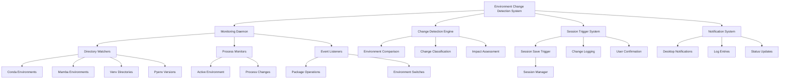

# Environment Change Detection Mechanism Design Specification

## Executive Summary

This document outlines the comprehensive design for an environment change detection mechanism that enhances the Hyprland Session Manager with proactive monitoring of development environment changes. The system will automatically detect when environments are created, modified, or destroyed and trigger automatic session saving to maintain session integrity.

## Current State Analysis

### ✅ Existing Environment Validation System

The system currently provides:

- **Comprehensive Detection**: Functions for conda, mamba, venv, and pyenv environments
- **Validation Framework**: Environment existence and health validation
- **Session Integration**: Save-time and restore-time environment validation
- **Metadata Capture**: Environment metadata storage in session state

### ❌ Missing Proactive Monitoring

The system lacks:

- **Real-time Change Detection**: No monitoring of environment state changes
- **Automatic Triggers**: No automatic session saving on environment changes
- **Background Monitoring**: No continuous monitoring daemon
- **User Notifications**: No alerts for detected environment changes

## Architecture Overview

### System Components



## 1. Real-Time Monitoring Architecture

### 1.1 Directory Watcher System

```bash
# Core directory monitoring using inotify
monitor_environment_directories() {
    local watch_dirs=()
    
    # Conda environments
    if command -v conda > /dev/null; then
        local conda_base=$(conda info --base 2>/dev/null)
        if [[ -n "$conda_base" ]]; then
            watch_dirs+=("$conda_base/envs")
        fi
    fi
    
    # Mamba environments
    if command -v mamba > /dev/null; then
        local mamba_base=$(mamba info --base 2>/dev/null)
        if [[ -n "$mamba_base" ]]; then
            watch_dirs+=("$mamba_base/envs")
        fi
    fi
    
    # Virtual environment locations
    watch_dirs+=(
        "$HOME/.virtualenvs"
        "$HOME/venvs"
        "$HOME/.venvs"
    )
    
    # Pyenv versions
    if command -v pyenv > /dev/null; then
        local pyenv_root=$(pyenv root 2>/dev/null)
        if [[ -n "$pyenv_root" ]]; then
            watch_dirs+=("$pyenv_root/versions")
        fi
    fi
    
    # Monitor all identified directories
    for dir in "${watch_dirs[@]}"; do
        if [[ -d "$dir" ]]; then
            monitor_directory "$dir"
        fi
    done
}

# Directory monitoring implementation
monitor_directory() {
    local directory="$1"
    
    # Use inotifywait for real-time monitoring
    inotifywait -m -r -e create,delete,modify,move \
        --format "%w%f %e %T" --timefmt "%Y-%m-%dT%H:%M:%S" \
        "$directory" | while read path event time; do
        
        log_info "Directory change detected: $path - $event at $time"
        handle_directory_change "$path" "$event" "$time"
    done &
    
    local monitor_pid=$!
    echo "$monitor_pid" >> "${SESSION_DIR}/monitor_pids.txt"
}
```

### 1.2 Process and Environment Monitoring

```bash
# Monitor active environment changes
monitor_active_environment() {
    local last_active_env=""
    
    while true; do
        local current_env=$(detect_active_environment)
        
        if [[ "$current_env" != "$last_active_env" ]]; then
            if [[ -n "$last_active_env" ]]; then
                log_info "Active environment changed: $last_active_env -> $current_env"
                handle_environment_switch "$last_active_env" "$current_env"
            fi
            last_active_env="$current_env"
        fi
        
        sleep 10  # Check every 10 seconds
    done
}

# Monitor package operations
monitor_package_operations() {
    # Watch for conda/mamba/pip operations
    local package_dirs=(
        "$HOME/.conda/pkgs"
        "$HOME/.cache/pip"
        "/tmp/pip-*"
    )
    
    for pattern in "${package_dirs[@]}"; do
        for dir in $pattern; do
            if [[ -d "$dir" ]]; then
                monitor_directory "$dir"
            fi
        done
    done
}
```

## 2. Change Detection Engine

### 2.1 Environment Comparison Logic

```bash
# Compare current environment state with baseline
detect_environment_changes() {
    local baseline_file="${SESSION_STATE_DIR}/environment_baseline.json"
    local current_file="${SESSION_STATE_DIR}/environment_current.json"
    
    # Capture current environment state
    capture_environment_snapshot "$current_file"
    
    if [[ ! -f "$baseline_file" ]]; then
        # First run - set baseline
        cp "$current_file" "$baseline_file"
        log_info "Environment baseline established"
        return 0
    fi
    
    # Compare baseline with current state
    local changes=$(compare_environment_states "$baseline_file" "$current_file")
    
    if [[ -n "$changes" ]]; then
        log_info "Environment changes detected: $changes"
        handle_environment_changes "$changes"
        
        # Update baseline
        cp "$current_file" "$baseline_file"
        return 1
    fi
    
    return 0
}

# Compare environment states
compare_environment_states() {
    local baseline="$1"
    local current="$2"
    
    local changes=()
    
    if command -v jq > /dev/null; then
        # Compare environment lists
        local baseline_envs=$(jq -r '.environments[] | "\(.type):\(.name)"' "$baseline" 2>/dev/null | sort)
        local current_envs=$(jq -r '.environments[] | "\(.type):\(.name)"' "$current" 2>/dev/null | sort)
        
        # Detect new environments
        local new_envs=$(comm -13 <(echo "$baseline_envs") <(echo "$current_envs"))
        if [[ -n "$new_envs" ]]; then
            changes+=("new_environments:$new_envs")
        fi
        
        # Detect removed environments
        local removed_envs=$(comm -23 <(echo "$baseline_envs") <(echo "$current_envs"))
        if [[ -n "$removed_envs" ]]; then
            changes+=("removed_environments:$removed_envs")
        fi
        
        # Compare environment metadata
        compare_environment_metadata "$baseline" "$current" changes
    fi
    
    echo "${changes[@]}"
}
```

### 2.2 Change Classification System

```bash
# Classify and prioritize environment changes
classify_environment_change() {
    local change_type="$1"
    local change_details="$2"
    
    case "$change_type" in
        "environment_created")
            echo "HIGH: New environment created"
            return 2
            ;;
        "environment_deleted")
            echo "HIGH: Environment deleted"
            return 2
            ;;
        "package_installed")
            echo "MEDIUM: Package installation"
            return 1
            ;;
        "package_updated")
            echo "LOW: Package update"
            return 0
            ;;
        "environment_switched")
            echo "INFO: Active environment changed"
            return 0
            ;;
        "configuration_modified")
            echo "MEDIUM: Environment configuration changed"
            return 1
            ;;
        *)
            echo "UNKNOWN: $change_type"
            return 0
            ;;
    esac
}

# Impact assessment for changes
assess_change_impact() {
    local change_type="$1"
    local env_type="$2"
    local env_name="$3"
    
    local impact_score=0
    
    # High impact changes
    case "$change_type" in
        "environment_created"|"environment_deleted")
            impact_score=3
            ;;
        "core_package_change")
            impact_score=2
            ;;
        "dependency_update")
            impact_score=1
            ;;
    esac
    
    # Environment type modifiers
    case "$env_type" in
        "conda"|"mamba")
            impact_score=$((impact_score + 1))
            ;;
        "venv")
            impact_score=$((impact_score + 0))
            ;;
        "pyenv")
            impact_score=$((impact_score + 1))
            ;;
    esac
    
    echo "$impact_score"
}
```

## 3. Monitoring Daemon Design

### 3.1 Main Monitoring Daemon

```bash
#!/usr/bin/env zsh
# environment-monitor-daemon.sh

# Configuration
MONITOR_INTERVAL=60  # seconds
CHANGE_THRESHOLD=2   # minimum impact score to trigger save
NOTIFICATION_ENABLED=true
AUTO_SAVE_ENABLED=true

# Main monitoring loop
main_monitoring_loop() {
    log_info "Starting environment monitoring daemon"
    
    # Initialize monitoring
    initialize_monitoring
    establish_baseline
    
    # Main monitoring loop
    while true; do
        # Real-time directory monitoring (background)
        monitor_environment_directories
        
        # Periodic full environment scan
        perform_periodic_scan
        
        # Active environment monitoring
        monitor_active_environment
        
        # Process monitoring
        monitor_package_operations
        
        # Wait for next cycle
        sleep "$MONITOR_INTERVAL"
        
        # Check for termination signal
        if [[ -f "${SESSION_DIR}/stop_monitoring" ]]; then
            log_info "Stopping environment monitoring"
            cleanup_monitoring
            exit 0
        fi
    done
}

# Initialize monitoring system
initialize_monitoring() {
    # Create monitoring state directory
    mkdir -p "${SESSION_DIR}/monitoring"
    
    # Clear previous monitor PIDs
    > "${SESSION_DIR}/monitor_pids.txt"
    
    # Initialize change log
    > "${SESSION_DIR}/monitoring/change_log.json"
    
    log_success "Environment monitoring initialized"
}

# Cleanup monitoring processes
cleanup_monitoring() {
    # Stop directory monitors
    if [[ -f "${SESSION_DIR}/monitor_pids.txt" ]]; then
        while read -r pid; do
            if kill -0 "$pid" 2>/dev/null; then
                kill "$pid"
            fi
        done < "${SESSION_DIR}/monitor_pids.txt"
        rm -f "${SESSION_DIR}/monitor_pids.txt"
    fi
    
    # Cleanup temporary files
    rm -f "${SESSION_DIR}/stop_monitoring"
    
    log_info "Environment monitoring cleanup completed"
}
```

### 3.2 Systemd Service Integration

```ini
# /etc/systemd/system/hyprland-environment-monitor.service
[Unit]
Description=Hyprland Environment Change Monitor
After=hyprland-session.target
Requires=hyprland-session.target

[Service]
Type=simple
User=%i
ExecStart=/home/%i/.config/hyprland-session-manager/environment-monitor-daemon.sh
Restart=on-failure
RestartSec=5
Environment=DISPLAY=:0
Environment=XAUTHORITY=/home/%i/.Xauthority

[Install]
WantedBy=hyprland-session.target
```

## 4. Session Trigger System

### 4.1 Automatic Session Saving

```bash
# Trigger automatic session save on environment changes
trigger_automatic_save() {
    local change_type="$1"
    local change_details="$2"
    local impact_score="$3"
    
    if [[ "$AUTO_SAVE_ENABLED" != "true" ]]; then
        log_info "Automatic saving disabled - change detected but not saving"
        return 0
    fi
    
    if [[ "$impact_score" -lt "$CHANGE_THRESHOLD" ]]; then
        log_info "Change impact below threshold ($impact_score < $CHANGE_THRESHOLD) - not saving"
        return 0
    fi
    
    log_info "Triggering automatic session save due to: $change_type"
    
    # Send desktop notification
    if [[ "$NOTIFICATION_ENABLED" == "true" ]]; then
        send_desktop_notification "Environment Change Detected" \
            "Saving session due to: $change_details" \
            "info"
    fi
    
    # Trigger session save
    if [[ -f "${SESSION_DIR}/session-manager.sh" ]]; then
        "${SESSION_DIR}/session-manager.sh" save
        local save_result=$?
        
        if [[ $save_result -eq 0 ]]; then
            log_success "Automatic session save completed successfully"
            send_desktop_notification "Session Saved" \
                "Session automatically saved due to environment changes" \
                "success"
        else
            log_error "Automatic session save failed"
            send_desktop_notification "Session Save Failed" \
                "Failed to automatically save session" \
                "error"
        fi
        
        return $save_result
    else
        log_error "Session manager not found at ${SESSION_DIR}/session-manager.sh"
        return 1
    fi
}

# Handle specific environment changes
handle_environment_changes() {
    local changes="$1"
    
    IFS=':' read -r change_type change_details <<< "$changes"
    local impact_score=$(assess_change_impact "$change_type" "$change_details")
    
    # Log the change
    log_environment_change "$change_type" "$change_details" "$impact_score"
    
    # Trigger appropriate action
    case "$change_type" in
        "environment_created"|"environment_deleted")
            trigger_automatic_save "$change_type" "$change_details" "$impact_score"
            ;;
        "package_installed"|"core_package_change")
            if [[ "$impact_score" -ge 2 ]]; then
                trigger_automatic_save "$change_type" "$change_details" "$impact_score"
            fi
            ;;
        *)
            log_info "Change type '$change_type' does not trigger automatic save"
            ;;
    esac
}
```

### 4.2 Change Logging and Reporting

```bash
# Log environment changes for audit and analysis
log_environment_change() {
    local change_type="$1"
    local change_details="$2"
    local impact_score="$3"
    
    local log_file="${SESSION_DIR}/monitoring/change_log.json"
    local log_entry=$(jq -n \
        --arg timestamp "$(date -Iseconds)" \
        --arg type "$change_type" \
        --arg details "$change_details" \
        --argjson impact "$impact_score" \
        '{
            timestamp: $timestamp,
            type: $type,
            details: $details,
            impact: $impact,
            action_taken: "logged"
        }')
    
    if [[ -f "$log_file" ]]; then
        jq ". += [$log_entry]" "$log_file" > "${log_file}.tmp" && mv "${log_file}.tmp" "$log_file"
    else
        echo "[$log_entry]" | jq '.' > "$log_file"
    fi
}

# Generate change reports
generate_change_report() {
    local report_file="${SESSION_DIR}/monitoring/change_report_$(date +%Y%m%d).json"
    local log_file="${SESSION_DIR}/monitoring/change_log.json"
    
    if [[ ! -f "$log_file" ]]; then
        echo "No change data available"
        return 1
    fi
    
    # Generate summary report
    jq '
    {
        report_date: "'$(date -Iseconds)'",
        total_changes: length,
        changes_by_type: group_by(.type) | map({type: .[0].type, count: length}),
        high_impact_changes: map(select(.impact >= 2)) | length,
        changes_today: map(select(.timestamp | startswith("'$(date +%Y-%m-%d)'"))) | length
    }
    ' "$log_file" > "$report_file"
    
    log_success "Change report generated: $report_file"
}
```

## 5. Notification System

### 5.1 Desktop Notifications

```bash
# Send desktop notifications for environment changes
send_desktop_notification() {
    local title="$1"
    local message="$2"
    local urgency="$3"  # low, normal, critical
    
    if command -v notify-send > /dev/null; then
        notify-send -u "$urgency" -t 5000 \
            "Hyprland Environment Monitor" \
            "$title: $message"
    elif command -v kdialog > /dev/null; then
        kdialog --title "Hyprland Environment Monitor" \
            --msgbox "$title: $message"
    else
        log_info "NOTIFICATION: $title - $message"
    fi
}

# Notification templates
notify_environment_created() {
    local env_type="$1"
    local env_name="$2"
    
    send_desktop_notification "Environment Created" \
        "New $env_type environment '$env_name' detected" \
        "normal"
}

notify_environment_deleted() {
    local env_type="$1"
    local env_name="$2"
    
    send_desktop_notification "Environment Deleted" \
        "$env_type environment '$env_name' was removed" \
        "critical"
}

notify_package_change() {
    local env_type="$1"
    local env_name="$2"
    local package_name="$3"
    
    send_desktop_notification "Package Change" \
        "Package '$package_name' changed in $env_type environment '$env_name'" \
        "normal"
}

notify_environment_switch() {
    local old_env="$1"
    local new_env="$2"
    
    send_desktop_notification "Environment Switched" \
        "Active environment changed from '$old_env' to '$new_env'" \
        "low"
}
