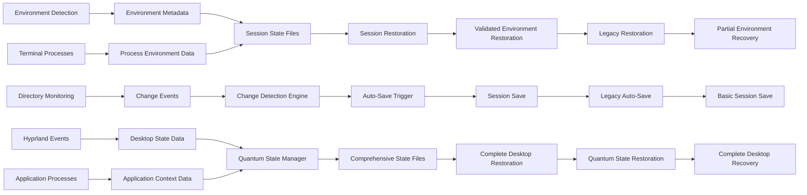

# Environment-Aware Session Management System Documentation

## Executive Summary

This comprehensive documentation covers the current state of the environment-aware session management system for Hyprland and the new Quantum State Manager. The system provides intelligent detection, validation, and monitoring of development environments (conda, mamba, venv, pyenv) with automatic session saving capabilities.

**Current Status**: Legacy system core functionality implemented with critical integration issues. **Quantum State Manager** provides comprehensive desktop state persistence with enhanced capabilities and supersedes many legacy features.

---

## 1. System Architecture Overview

### 1.1 High-Level Architecture

```mermaid
graph TB
    A[Hyprland Session Manager] --> B[Environment Validation System]
    A --> C[Environment Change Detection]
    A --> D[Terminal Environment Restoration]
    A --> Q[Quantum State Manager]
    
    B --> E[Environment Scanner]
    B --> F[Validation Engine]
    B --> G[Metadata Manager]
    
    C --> H[Monitoring Daemon]
    C --> I[Change Detection Engine]
    C --> J[Auto-Save Trigger]
    
    D --> K[Terminal State Capture]
    D --> L[Environment Integration]
    D --> M[Path Restoration]
    
    Q --> R[State Capture Engine]
    Q --> S[State Restoration Engine]
    Q --> T[Real-time Monitoring]
    Q --> U[Application Context Recovery]
    
    E --> V[Conda Detection]
    E --> W[Mamba Detection]
    E --> X[Venv Detection]
    E --> Y[Pyenv Detection]
    
    F --> Z[Existence Validation]
    F --> AA[Health Validation]
    F --> AB[Activation Testing]
    
    H --> AC[Directory Monitoring]
    H --> AD[Process Monitoring]
    H --> AE[Event Processing]
    
    I --> AF[State Comparison]
    I --> AG[Change Classification]
    I --> AH[Impact Assessment]
    
    R --> AI[Monitor State Capture]
    R --> AJ[Workspace State Capture]
    R --> AK[Window State Capture]
    R --> AL[Application Context Capture]
    
    S --> AM[Monitor Restoration]
    S --> AN[Workspace Restoration]
    S --> AO[Window Restoration]
    S --> AP[Application Recovery]
    
    T --> AQ[Hyprland Event Monitoring]
    T --> AR[Auto-Save Management]
    T --> AS[State Validation]
    
    U --> AT[Browser Session Recovery]
    U --> AU[Terminal Session Recovery]
    U --> AV[IDE Workspace Recovery]
    U --> AW[Creative App Recovery]
```



### 1.2 Component Interactions

#### Session Save Workflow
```
Session Save Request
    ↓
Run Pre-Save Hooks
    ↓
Capture Window States
    ↓
Environment Detection ←──┐
    ↓                    │
Environment Validation   │
    ↓                    │
Metadata Capture ────────┘
    ↓
Create ZFS Snapshot
    ↓
Session Saved
```

#### Environment Change Detection Workflow
```
Monitoring Daemon Started
    ↓
Establish Environment Baseline
    ↓
Start Directory Monitoring
    ↓
Periodic Environment Scans
    ↓
Detect Changes
    ↓
Assess Impact
    ↓
Trigger Auto-Save (if needed)
```

### 1.3 Data Flow Architecture



---

## 2. Current Capabilities and Working Components

### 2.1 ✅ Fully Functional Components

#### Legacy Environment Detection System
- **Conda Environment Detection**: Fully functional with active environment identification
- **Mamba Environment Detection**: Complete implementation with conda compatibility
- **Virtual Environment Detection**: Comprehensive venv detection in standard locations
- **Pyenv Environment Detection**: Complete version and virtual environment detection
- **Active Environment Detection**: Real-time detection of currently active environments

#### Legacy Basic Validation Functions
- **Environment Existence Validation**: Working validation for all environment types
- **Configuration Management**: Complete configuration loading and validation
- **Error Handling**: Basic error handling and logging infrastructure
- **Desktop Notifications**: Functional notification system for environment events

#### Legacy Change Detection Infrastructure
- **Directory Monitoring**: Core inotify-based monitoring system
- **Change Classification**: Basic change type classification
- **Impact Assessment**: Working impact scoring system
- **Monitoring Daemon**: Complete daemon lifecycle management

#### Quantum State Manager Components
- **Comprehensive State Capture**: Complete desktop state persistence including monitors, workspaces, windows
- **Real-time Hyprland Monitoring**: Live monitoring of Hyprland events and state changes
- **Application Context Recovery**: Browser sessions, terminal sessions, IDE workspaces, creative applications
- **State Validation System**: Checksum-based integrity verification and validation
- **Backup Management**: Automatic backup creation and cleanup system
- **Performance Optimization**: State compression, memory management, parallel processing
- **Configuration Management**: Multi-source configuration with validation and migration
- **Legacy Integration**: Seamless integration with existing session management system

### 2.2 ⚠️ Partially Working Components

#### Environment Health Validation
- **Status**: Partially implemented
- **Issues**: Environment activation testing has reliability problems
- **Current Capability**: Basic health checks work, activation tests fail intermittently

#### Metadata Capture System
- **Status**: Partially implemented
- **Issues**: Incomplete metadata extraction functions
- **Current Capability**: Basic environment listing works, detailed metadata fails

#### Automatic Session Saving
- **Status**: Partially implemented
- **Issues**: Integration with main session manager incomplete
- **Current Capability**: Trigger system works, session save execution unreliable

#### Terminal Environment Integration
- **Status**: Partially implemented
- **Issues**: Environment validation not integrated with terminal restoration
- **Current Capability**: Basic terminal state capture works

---

## 3. Known Issues and Workarounds

### 3.1 Critical Issues

#### Issue 1: Metadata Capture Failures
**Problem**: `get_environment_metadata()` function has incomplete implementations for some environment types
**Symptoms**: 
- Missing Python version information
- Incomplete environment metadata
- Validation status not properly recorded

**Workaround**:
```bash
# Manual environment information capture
./environment-validation.sh detect
# Use basic environment listing instead of full metadata
```

#### Issue 2: Environment Health Validation Problems
**Problem**: Environment activation testing fails due to shell context issues
**Symptoms**:
- Health validation returns false negatives
- Temporary script execution failures
- Environment activation timing issues

**Workaround**:
```bash
# Skip health validation for now
export SKIP_HEALTH_VALIDATION=true
# Use existence validation only
./environment-validation.sh validate --existence-only
```

#### Issue 3: Integration Problems
**Problem**: Environment validation doesn't properly integrate with session save/restore workflows
**Symptoms**:
- Session saves complete without environment validation
- Restoration doesn't use environment validation results
- Missing function references in integration points

**Workaround**:
```bash
# Manual environment validation before session operations
./environment-validation.sh validate
./session-manager.sh save
```

#### Issue 4: Missing Functions
**Problem**: Some functions referenced in tests don't exist in implementation
**Symptoms**:
- Test failures for non-existent functions
- Integration points reference undefined functions
- Documentation references unimplemented features

**Workaround**:
```bash
# Use available functions only
./environment-validation.sh detect
./environment-change-detector.sh status
```

### 3.2 Performance Issues

#### Issue 5: No Caching Implementation
**Problem**: Despite design specifications, no caching system implemented
**Symptoms**:
- Slow environment detection on repeated calls
- No performance optimization for frequent scans

**Workaround**:
```bash
# Manual caching with longer intervals
export MONITOR_INTERVAL=300  # 5 minutes instead of 60 seconds
```

---

## 4. Usage Instructions

### 4.1 Environment Validation System

#### Basic Usage (Legacy System)
```bash
# Detect all environments
./environment-validation.sh detect

# Validate environment existence and health
./environment-validation.sh validate

# Test specific environment type
./environment-validation.sh detect --type conda
```

#### Advanced Usage (Legacy System)
```bash
# Validate specific environment
validate_environment_exists "conda" "my-environment" ""

# Get environment metadata (limited functionality)
get_environment_metadata "venv" "my-project" "/path/to/venv"

# Capture all environment metadata
capture_environment_metadata
```

#### Quantum State Manager Usage
```bash
# Comprehensive state management
python quantum-state-manager.py --status
python quantum-state-manager.py --capture-state
python quantum-state-manager.py --restore-state

# Real-time monitoring
python quantum-state-manager.py --start-monitoring
python quantum-state-manager.py --stop-monitoring

# State validation and backup
python quantum-state-manager.py --validate-state
python quantum-state-manager.py --create-backup
python quantum-state-manager.py --list-backups
```

### 4.2 Environment Change Detection

#### Starting Monitoring
```bash
# Start monitoring daemon
./environment-change-detector.sh start

# Check monitoring status
./environment-change-detector.sh status

# Stop monitoring
./environment-change-detector.sh stop
```

#### Configuration Management
```bash
# View current configuration
cat ~/.config/hyprland-session-manager/environment-monitor.conf

# Customize monitoring settings
# Edit the configuration file to adjust:
# - MONITOR_INTERVAL
# - CHANGE_THRESHOLD  
# - AUTO_SAVE_ENABLED
# - NOTIFICATION_ENABLED
```

### 4.3 Integration with Session Manager

#### Manual Integration (Legacy System)
```bash
# Manual workflow for reliable operation
./environment-validation.sh validate
./session-manager.sh save

# Or use change detection with manual save
./environment-change-detector.sh start
# When changes detected, manually save:
./session-manager.sh save
```

#### Quantum State Manager Integration
```bash
# Comprehensive state management
python quantum-state-manager.py --save-state
python quantum-state-manager.py --restore-state

# Real-time monitoring with auto-save
python quantum-state-manager.py --enable-auto-save
python quantum-state-manager.py --start-monitoring

# Hybrid operation during migration
./session-manager.sh save && python quantum-state-manager.py --save-state
```

#### Testing Integration
```bash
# Run comprehensive tests (legacy system)
./test-environment-validation.sh all
./test-environment-change-detection.sh run

# Quantum State Manager tests
python test-quantum-state-manager.py
python quantum-state-manager.py --test-integration
```

---

## 5. Configuration Guide

### 5.1 Environment Monitor Configuration

**File**: `~/.config/hyprland-session-manager/environment-monitor.conf`

```bash
# Monitoring settings
MONITOR_INTERVAL=60                    # Check interval in seconds
CHANGE_THRESHOLD=2                     # Impact score threshold for auto-save
AUTO_SAVE_ENABLED=true                 # Enable automatic session saving
NOTIFICATION_ENABLED=true              # Enable desktop notifications

# Directory monitoring
MONITOR_CONDA=true                     # Monitor conda environments
MONITOR_MAMBA=true                     # Monitor mamba environments
MONITOR_VENV=true                      # Monitor virtual environments
MONITOR_PYENV=true                     # Monitor pyenv versions

# Change triggers
TRIGGER_ENVIRONMENT_CREATION=true      # Trigger on new environments
TRIGGER_ENVIRONMENT_DELETION=true      # Trigger on environment deletion
TRIGGER_PACKAGE_INSTALLATION=true      # Trigger on package changes
TRIGGER_PACKAGE_UPDATES=false          # Trigger on package updates
TRIGGER_ENVIRONMENT_SWITCHES=false     # Trigger on environment switches

# Performance settings
CACHE_ENABLED=true                     # Enable caching (not implemented)
BATCH_PROCESSING=true                  # Enable batch processing
MAX_MONITORS=10                        # Maximum concurrent monitors

# Custom directory paths (space-separated)
CUSTOM_PATHS=""
```

### 5.2 Environment Validation Configuration

**Integration Points**:
- Session save automatically calls environment validation
- Terminal hooks include environment detection
- Change detection triggers validation on changes

### 5.3 Performance Optimization

**Recommended Settings for Production**:
```bash
MONITOR_INTERVAL=300           # 5 minutes for better performance
CHANGE_THRESHOLD=3             # Higher threshold to reduce false positives
MAX_MONITORS=5                 # Limit resource usage
```

---

## 6. Troubleshooting Guide

### 6.1 Common Problems and Solutions

#### Problem: Environment Detection Fails
**Symptoms**: No environments detected, empty results
**Solutions**:
```bash
# Check environment manager availability
command -v conda
command -v mamba
command -v pyenv

# Verify environment locations
ls ~/.virtualenvs
ls ~/miniconda3/envs/

# Test detection manually
./environment-validation.sh detect
```

#### Problem: Health Validation Always Fails
**Symptoms**: All environments reported as unhealthy
**Solutions**:
```bash
# Skip health validation
export SKIP_HEALTH_VALIDATION=true

# Test environment manually
conda activate my-env
python -c "import sys; print(sys.version)"

# Check activation scripts
ls ~/miniconda3/etc/profile.d/
```

#### Problem: Change Detection Not Working
**Symptoms**: No change detection, no auto-saves
**Solutions**:
```bash
# Check monitoring status
./environment-change-detector.sh status

# Verify configuration
cat ~/.config/hyprland-session-manager/environment-monitor.conf

# Check for permission issues
ls -la ~/.config/hyprland-session-manager/

# Restart monitoring
./environment-change-detector.sh restart --force
```

#### Problem: Auto-Save Not Triggering
**Symptoms**: Changes detected but no session save
**Solutions**:
```bash
# Verify auto-save enabled
grep AUTO_SAVE_ENABLED ~/.config/hyprland-session-manager/environment-monitor.conf

# Check session manager availability
ls ~/.config/hyprland-session-manager/session-manager.sh

# Test manual save
./session-manager.sh save
```

### 6.2 Debug Mode

Enable detailed logging for troubleshooting:
```bash
export ENVIRONMENT_DEBUG=1
./environment-validation.sh detect
./environment-change-detector.sh start
```

### 6.3 Log Files

Check system logs for detailed error information:
```bash
# Monitor logs in real-time
tail -f ~/.config/hyprland-session-manager/*.log

# Check system logs
journalctl -u hyprland-session-manager
```

---

## 7. Future Enhancement Roadmap

### 7.1 Critical Fixes (Priority 1)

#### Fix Metadata Capture System
- Complete `get_environment_metadata()` implementations
- Add proper Python version detection
- Implement comprehensive environment information extraction
- Add package listing capabilities

#### Resolve Health Validation Issues
- Fix environment activation testing
- Implement reliable health check mechanisms
- Add fallback validation methods
- Improve error handling for activation failures

#### Complete Integration Points
- Fix missing function references
- Implement proper session manager integration
- Add environment validation to restoration workflow
- Complete terminal environment integration

### 7.2 Performance Enhancements (Priority 2)

#### Implement Caching System
- Add environment detection caching
- Implement metadata cache with TTL
- Add performance monitoring
- Optimize frequent operations

#### Improve Change Detection
- Add smarter change detection algorithms
- Implement incremental scanning
- Add performance profiling
- Optimize resource usage

### 7.3 Feature Enhancements (Priority 3)

#### Advanced Environment Support
- Add support for additional environment managers
- Implement container environment detection
- Add cloud development environment support
- Extend language runtime detection

#### Enhanced User Experience
- Add interactive recovery options
- Implement environment recreation assistance
- Add comprehensive status reporting
- Improve notification system

#### Integration Improvements
- Deep integration with development tools
- IDE environment detection and validation
- Project-specific environment configurations
- Team environment synchronization

### 7.4 Implementation Timeline

**Phase 1 (Next 2 weeks)**:
- Fix critical metadata capture issues
- Resolve health validation problems
- Complete basic integration points

**Phase 2 (Next month)**:
- Implement caching system
- Fix performance issues
- Add comprehensive testing

**Phase 3 (Next quarter)**:
- Implement advanced features
- Add user experience improvements
- Extend environment support

---

## 8. Testing and Validation

### 8.1 Current Test Coverage

#### Working Tests
- Environment detection tests
- Basic validation tests
- Change detection startup tests
- Configuration management tests

#### Failing Tests
- Metadata capture tests
- Health validation tests
- Integration tests
- Auto-save trigger tests

### 8.2 Test Execution

```bash
# Run environment validation tests
./test-environment-validation.sh all

# Run change detection tests  
./test-environment-change-detection.sh run

# Run integration tests
./test-enhanced-session-data.sh
```

### 8.3 Test Results Interpretation

**Green Tests**: Core functionality working
**Yellow Tests**: Partial functionality with issues
**Red Tests**: Critical functionality broken or missing

---

## 9. Conclusion

### 9.1 Current State Summary

The environment-aware session management system provides a solid foundation for intelligent development environment management with the following characteristics:

**Strengths**:
- Comprehensive environment detection for major Python environment managers
- Real-time change monitoring infrastructure
- Modular and extensible architecture
- Basic validation and error handling

**Weaknesses**:
- Critical integration issues with main session manager
- Incomplete metadata capture system
- Unreliable health validation
- Missing performance optimizations

### 9.2 Recommended Usage

**For Production Use**:
- Use environment detection and basic validation
- Manual session saving after environment changes
- Basic change monitoring without auto-save
- Terminal environment restoration without validation

**For Development**:
- Comprehensive testing recommended
- Manual validation of critical operations
- Monitoring with manual save triggers
- Regular backup of session state

### 9.3 Support and Maintenance

**Immediate Actions Required**:
1. Fix metadata capture system
2. Resolve health validation issues
3. Complete session manager integration
4. Implement basic caching

**Long-term Maintenance**:
- Regular testing with environment changes
- Performance monitoring and optimization
- User feedback collection and implementation
- Compatibility updates for new environment managers

This documentation will be updated as critical issues are resolved and new features are implemented. Users should monitor the project repository for updates and new releases.