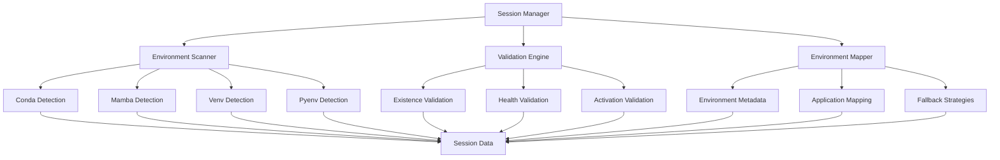

# Environment Validation System Design Specification

## Executive Summary

This document outlines the comprehensive design for an environment validation system that enhances the Hyprland Session Manager with systematic detection, validation, and restoration of development environments (conda, mamba, venv, .venv, pyenv) for terminal applications.

## Current State Analysis

### ✅ Existing Terminal Environment Restoration
The system currently provides:
- Current working directory preservation
- Environment variable capture via `/proc/$pid/environ`
- Terminal-specific IPC methods (Kitty, Alacritty)
- Workspace-aware terminal positioning
- Graceful degradation for unsupported features

### ❌ Missing Environment Validation
The system lacks:
- Development environment detection and validation
- Environment existence verification before restoration
- Environment-to-application mapping
- Graceful fallback for missing environments
- Systematic environment health checks

## Architecture Overview

### System Components



## 1. Environment Scanner Functions

### 1.1 Conda Environment Detection

```bash
# Detect conda environments and active environments
detect_conda_environments() {
    local env_data=()
    
    # Check if conda is available
    if command -v conda > /dev/null; then
        # Get active conda environment
        local active_env=$(conda info --base 2>/dev/null | xargs basename 2>/dev/null || echo "")
        if [[ -n "$active_env" ]]; then
            env_data+=("conda:$active_env:active")
        fi
        
        # Get all conda environments
        local env_list=$(conda env list --json 2>/dev/null | jq -r '.envs[]' 2>/dev/null || echo "")
        for env_path in $env_list; do
            local env_name=$(basename "$env_path")
            if [[ "$env_name" != "$active_env" ]]; then
                env_data+=("conda:$env_name:available")
            fi
        done
    fi
    
    echo "${env_data[@]}"
}
```

### 1.2 Mamba Environment Detection

```bash
# Detect mamba environments (conda-compatible)
detect_mamba_environments() {
    local env_data=()
    
    # Check if mamba is available
    if command -v mamba > /dev/null; then
        # Get active mamba environment
        local active_env=$(mamba info --base 2>/dev/null | xargs basename 2>/dev/null || echo "")
        if [[ -n "$active_env" ]]; then
            env_data+=("mamba:$active_env:active")
        fi
        
        # Get all mamba environments
        local env_list=$(mamba env list --json 2>/dev/null | jq -r '.envs[]' 2>/dev/null || echo "")
        for env_path in $env_list; do
            local env_name=$(basename "$env_path")
            if [[ "$env_name" != "$active_env" ]]; then
                env_data+=("mamba:$env_name:available")
            fi
        done
    fi
    
    echo "${env_data[@]}"
}
```

### 1.3 Virtual Environment Detection

```bash
# Detect Python virtual environments
detect_venv_environments() {
    local env_data=()
    
    # Check for virtual environments in common locations
    local venv_locations=(
        "$HOME/.virtualenvs"
        "$HOME/venvs"
        "$HOME/.venvs"
        "./.venv"
        "./venv"
        "../.venv"
        "../venv"
    )
    
    for location in "${venv_locations[@]}"; do
        if [[ -d "$location" ]]; then
            # Find all virtual environments in this location
            local envs=$(find "$location" -maxdepth 1 -type d -name "*" 2>/dev/null)
            for env_path in $envs; do
                if [[ -f "$env_path/bin/activate" || -f "$env_path/Scripts/activate" ]]; then
                    local env_name=$(basename "$env_path")
                    env_data+=("venv:$env_name:$env_path")
                fi
            done
        fi
    done
    
    # Check for .venv in current and parent directories
    local current_dir=$(pwd)
    while [[ "$current_dir" != "/" ]]; do
        if [[ -d "$current_dir/.venv" && (-f "$current_dir/.venv/bin/activate" || -f "$current_dir/.venv/Scripts/activate") ]]; then
            local env_name=$(basename "$current_dir")
            env_data+=("venv:$env_name:$current_dir/.venv")
            break
        fi
        current_dir=$(dirname "$current_dir")
    done
    
    echo "${env_data[@]}"
}
```

### 1.4 Pyenv Environment Detection

```bash
# Detect pyenv environments and virtual environments
detect_pyenv_environments() {
    local env_data=()
    
    # Check if pyenv is available
    if command -v pyenv > /dev/null; then
        # Get active pyenv version
        local active_version=$(pyenv version-name 2>/dev/null || echo "")
        if [[ -n "$active_version" && "$active_version" != "system" ]]; then
            env_data+=("pyenv:$active_version:active")
        fi
        
        # Get all installed pyenv versions
        local versions=$(pyenv versions --bare 2>/dev/null || echo "")
        for version in $versions; do
            if [[ "$version" != "$active_version" && "$version" != "system" ]]; then
                env_data+=("pyenv:$version:available")
            fi
        done
        
        # Get pyenv virtual environments
        if command -v pyenv-virtualenv > /dev/null; then
            local virtualenvs=$(pyenv virtualenvs --bare 2>/dev/null || echo "")
            for virtualenv in $virtualenvs; do
                env_data+=("pyenv-virtualenv:$virtualenv:available")
            done
        fi
    fi
    
    echo "${env_data[@]}"
}
```

## 2. Validation Functions

### 2.1 Environment Existence Validation

```bash
# Validate environment existence and accessibility
validate_environment_existence() {
    local env_type="$1"
    local env_name="$2"
    local env_path="$3"
    
    case "$env_type" in
        "conda")
            if command -v conda > /dev/null; then
                conda env list --json | jq -e ".envs[] | select(endswith(\"$env_name\"))" > /dev/null 2>&1
                return $?
            fi
            ;;
        "mamba")
            if command -v mamba > /dev/null; then
                mamba env list --json | jq -e ".envs[] | select(endswith(\"$env_name\"))" > /dev/null 2>&1
                return $?
            fi
            ;;
        "venv")
            if [[ -d "$env_path" && (-f "$env_path/bin/activate" || -f "$env_path/Scripts/activate") ]]; then
                return 0
            fi
            ;;
        "pyenv")
            if command -v pyenv > /dev/null; then
                pyenv versions --bare | grep -q "^$env_name$" > /dev/null 2>&1
                return $?
            fi
            ;;
        "pyenv-virtualenv")
            if command -v pyenv > /dev/null && command -v pyenv-virtualenv > /dev/null; then
                pyenv virtualenvs --bare | grep -q "^$env_name$" > /dev/null 2>&1
                return $?
            fi
            ;;
    esac
    
    return 1
}
```

### 2.2 Environment Health Validation

```bash
# Validate environment health and functionality
validate_environment_health() {
    local env_type="$1"
    local env_name="$2"
    local env_path="$3"
    
    case "$env_type" in
        "conda"|"mamba")
            # Test conda/mamba environment activation and basic commands
            local temp_script=$(mktemp)
            cat > "$temp_script" << 'EOF'
#!/bin/bash
source $(conda info --base)/etc/profile.d/conda.sh
conda activate "$1"
python -c "import sys; print(f'Python {sys.version}')" > /dev/null 2>&1
exit $?
EOF
            chmod +x "$temp_script"
            "$temp_script" "$env_name"
            local result=$?
            rm -f "$temp_script"
            return $result
            ;;
        "venv")
            # Test virtual environment activation
            local temp_script=$(mktemp)
            cat > "$temp_script" << 'EOF'
#!/bin/bash
source "$1/bin/activate"
python -c "import sys; print(f'Python {sys.version}')" > /dev/null 2>&1
exit $?
EOF
            chmod +x "$temp_script"
            "$temp_script" "$env_path"
            local result=$?
            rm -f "$temp_script"
            return $result
            ;;
        "pyenv")
            # Test pyenv environment
            pyenv shell "$env_name" && python -c "import sys; print(f'Python {sys.version}')" > /dev/null 2>&1
            return $?
            ;;
    esac
    
    return 1
}
```

## 3. Enhanced Session Data Structures

### 3.1 Environment Metadata Format

```json
{
  "environment_metadata": {
    "timestamp": "2024-01-15T10:30:00Z",
    "environments": [
      {
        "type": "conda",
        "name": "data-science",
        "path": "/home/user/miniconda3/envs/data-science",
        "python_version": "3.9.12",
        "status": "active",
        "validation": {
          "exists": true,
          "healthy": true,
          "last_validated": "2024-01-15T10:30:00Z"
        },
        "applications": [
          {
            "class": "kitty",
            "pid": 12345,
            "workspace": 1,
            "window_address": "0x12345678"
          }
        ]
      }
    ]
  }
}
```

### 3.2 Terminal Environment Enhancement

```json
{
  "terminal_states": {
    "kitty": [
      {
        "window_address": "0x12345678",
        "workspace": 1,
        "current_directory": "/home/user/projects/my-project",
        "environment": {
          "PWD": "/home/user/projects/my-project",
          "TERM": "xterm-kitty",
          "SHELL": "/bin/zsh",
          "PATH": "/usr/local/bin:/usr/bin:/bin",
          "CONDA_DEFAULT_ENV": "data-science",
          "VIRTUAL_ENV": "/home/user/projects/my-project/.venv"
        },
        "development_environments": [
          {
            "type": "conda",
            "name": "data-science",
            "active": true
          },
          {
            "type": "venv",
            "name": "my-project",
            "path": "/home/user/projects/my-project/.venv",
            "active": false
          }
        ],
        "shell_pid": 12345,
        "timestamp": "2024-01-15T10:30:00Z"
      }
    ]
  }
}
```

## 4. Integration Points

### 4.1 Save-Time Validation Integration

```bash
# Enhanced session save with environment validation
enhanced_save_session() {
    log_info "Starting enhanced session save with environment validation..."
    
    # Run pre-save hooks
    run_pre_save_hooks
    
    # Save timestamp
    date '+%Y-%m-%d %H:%M:%S' > "${SESSION_STATE_DIR}/save_timestamp.txt"
    
    # Save window states
    save_window_states
    
    # Save applications
    save_applications
    
    # Capture and validate environments
    capture_environment_metadata
    validate_environments
    
    # Create ZFS snapshot
    create_zfs_snapshot
    
    log_success "Enhanced session saved with environment validation"
}

# Capture environment metadata
capture_environment_metadata() {
    log_info "Capturing environment metadata..."
    
    local env_file="${SESSION_STATE_DIR}/environment_metadata.json"
    local env_data=()
    
    # Detect all environment types
    env_data+=($(detect_conda_environments))
    env_data+=($(detect_mamba_environments))
    env_data+=($(detect_venv_environments))
    env_data+=($(detect_pyenv_environments))
    
    # Process and save environment data
    local json_data='{"timestamp": "'$(date -Iseconds)'", "environments": ['
    local first=true
    
    for env_entry in "${env_data[@]}"; do
        IFS=':' read -r env_type env_name env_status <<< "$env_entry"
        
        if [[ "$first" == "true" ]]; then
            first=false
        else
            json_data+=','
        fi
        
        json_data+='{"type": "'$env_type'", "name": "'$env_name'", "status": "'$env_status'"}'
    done
    
    json_data+=']}'
    
    echo "$json_data" | jq '.' > "$env_file" 2>/dev/null
    log_success "Environment metadata captured"
}
```

### 4.2 Restore-Time Validation Integration

```bash
# Enhanced session restore with environment validation
enhanced_restore_session() {
    log_info "Starting enhanced session restore with environment validation..."
    
    if [[ ! -d "$SESSION_STATE_DIR" ]]; then
        log_error "No saved session found"
        return 1
    fi
    
    # Wait for Hyprland initialization
    log_info "Waiting for Hyprland to be ready..."
    sleep 3
    
    # Validate environments before restoration
    if ! validate_restoration_environments; then
        log_warning "Environment validation failed - proceeding with fallback restoration"
        fallback_restore_session
        return $?
    fi
    
    # Enhanced restoration workflow
    create_workspaces_from_layout
    restore_applications_with_workspaces
    sleep 5
    restore_window_positions
    restore_workspace_focus
    run_post_restore_hooks
    validate_workspace_restoration
    
    log_success "Enhanced session restored with environment validation"
}

# Validate environments for restoration
validate_restoration_environments() {
    local env_file="${SESSION_STATE_DIR}/environment_metadata.json"
    
    if [[ ! -f "$env_file" ]]; then
        log_info "No environment metadata found - skipping validation"
        return 0
    fi
    
    log_info "Validating environments for restoration..."
    
    local missing_envs=()
    local unhealthy_envs=()
    
    # Process each environment from saved metadata
    jq -c '.environments[]' "$env_file" 2>/dev/null | while read -r env; do
        local env_type=$(echo "$env" | jq -r '.type')
        local env_name=$(echo "$env" | jq -r '.name')
        local env_status=$(echo "$env" | jq -r '.status')
        
        # Validate environment existence
        if ! validate_environment_existence "$env_type" "$env_name" ""; then
            missing_envs+=("$env_type:$env_name")
            log_warning "Environment missing: $env_type:$env_name"
            continue
        fi
        
        # Validate environment health for active environments
        if [[ "$env_status" == "active" ]]; then
            if ! validate_environment_health "$env_type" "$env_name" ""; then
                unhealthy_envs+=("$env_type:$env_name")
                log_warning "Environment unhealthy: $env_type:$env_name"
            fi
        fi
    done
    
    # Report validation results
    if [[ ${#missing_envs[@]} -eq 0 && ${#unhealthy_envs[@]} -eq 0 ]]; then
        log_success "All environments validated successfully"
        return 0
    else
        log_warning "Environment validation completed with issues"
        log_info "Missing environments: ${missing_envs[*]}"
        log_info "Unhealthy environments: ${unhealthy_envs[*]}"
        return 1
    fi
}

## 6. Error Handling and Fallback Mechanisms

### 6.1 Graceful Fallback Strategies

```bash
# Fallback restoration when environments are missing
fallback_restore_session() {
    log_info "Starting fallback session restoration..."
    
    # Create basic workspaces
    create_workspaces_from_layout
    
    # Launch applications without environment validation
    restore_applications_with_workspaces
    
    # Provide user feedback about missing environments
    report_missing_environments
    
    # Continue with basic restoration
    sleep 5
    restore_window_positions
    restore_workspace_focus
    run_post_restore_hooks
    
    log_success "Fallback session restoration completed"
}

# Report missing environments to user
report_missing_environments() {
    local env_file="${SESSION_STATE_DIR}/environment_metadata.json"
    
    if [[ ! -f "$env_file" ]]; then
        return 0
    fi
    
    log_warning "Some development environments are missing or unavailable:"
    
    jq -c '.environments[]' "$env_file" 2>/dev/null | while read -r env; do
        local env_type=$(echo "$env" | jq -r '.type')
        local env_name=$(echo "$env" | jq -r '.name')
        local env_status=$(echo "$env" | jq -r '.status')
        
        if ! validate_environment_existence "$env_type" "$env_name" ""; then
            log_warning "  - $env_type environment '$env_name' is missing"
        elif [[ "$env_status" == "active" ]] && ! validate_environment_health "$env_type" "$env_name" ""; then
            log_warning "  - $env_type environment '$env_name' is unhealthy"
        fi
    done
    
    log_info "Applications will launch with system Python environment"
}
```

### 6.2 User Feedback and Recovery Options

```bash
# Provide interactive recovery options
provide_recovery_options() {
    local missing_envs=()
    local unhealthy_envs=()
    
    # Collect environment issues
    jq -c '.environments[]' "${SESSION_STATE_DIR}/environment_metadata.json" 2>/dev/null | while read -r env; do
        local env_type=$(echo "$env" | jq -r '.type')
        local env_name=$(echo "$env" | jq -r '.name')
        
        if ! validate_environment_existence "$env_type" "$env_name" ""; then
            missing_envs+=("$env_type:$env_name")
        elif ! validate_environment_health "$env_type" "$env_name" ""; then
            unhealthy_envs+=("$env_type:$env_name")
        fi
    done
    
    if [[ ${#missing_envs[@]} -gt 0 || ${#unhealthy_envs[@]} -gt 0 ]]; then
        log_warning "Environment issues detected. Recovery options:"
        log_info "1. Continue with fallback (system Python)"
        log_info "2. Attempt environment recreation"
        log_info "3. Skip environment-dependent applications"
        
        # In a real implementation, this would be interactive
        log_info "Auto-selecting option 1: Continue with fallback"
    fi
}
```

## 7. Hook Integration Architecture

### 7.1 Enhanced Terminal Hook Template

```bash
#!/usr/bin/env zsh
# Enhanced terminal environment hook with validation

# Enhanced save function with environment validation
save_terminal_environment_enhanced() {
    local app_class="$1"
    local app_state_dir="${SESSION_STATE_DIR}/terminal-environments"
    
    mkdir -p "$app_state_dir"
    
    # Get terminal windows
    local terminal_windows=$(hyprctl clients -j | jq -r ".[] | select(.class == \"$app_class\") | .address")
    
    for window in $terminal_windows; do
        local window_data=$(hyprctl clients -j | jq -r ".[] | select(.address == \"$window\")")
        local workspace=$(echo "$window_data" | jq -r '.workspace.id')
        local pid=$(echo "$window_data" | jq -r '.pid')
        
        # Save terminal environment data with validation
        save_terminal_state_enhanced "$app_class" "$window" "$workspace" "$pid"
        
        # Track application environments
        track_application_environments "$app_class" "$window" "$pid"
    done
}

# Enhanced terminal state saving with environment validation
save_terminal_state_enhanced() {
    local app_class="$1"
    local window="$2"
    local workspace="$3"
    local pid="$4"
    
    local state_file="${SESSION_STATE_DIR}/terminal-environments/${app_class}_${window}.json"
    
    # Get current directory from process
    local current_dir=$(readlink "/proc/$pid/cwd" 2>/dev/null || echo "")
    
    # Get environment variables
    local env_vars=""
    if [[ -f "/proc/$pid/environ" ]]; then
        env_vars=$(cat "/proc/$pid/environ" | tr '\0' '\n')
    fi
    
    # Extract development environment information
    local dev_environments="[]"
    local conda_env=$(echo "$env_vars" | grep "^CONDA_DEFAULT_ENV=" | cut -d= -f2)
    local venv_path=$(echo "$env_vars" | grep "^VIRTUAL_ENV=" | cut -d= -f2)
    local pyenv_version=$(echo "$env_vars" | grep "^PYENV_VERSION=" | cut -d= -f2)
    
    if [[ -n "$conda_env" ]]; then
        dev_environments=$(echo "$dev_environments" | jq ". += [{\"type\": \"conda\", \"name\": \"$conda_env\", \"active\": true}]")
    fi
    
    if [[ -n "$venv_path" ]]; then
        local venv_name=$(basename "$venv_path")
        dev_environments=$(echo "$dev_environments" | jq ". += [{\"type\": \"venv\", \"name\": \"$venv_name\", \"path\": \"$venv_path\", \"active\": true}]")
    fi
    
    if [[ -n "$pyenv_version" ]]; then
        dev_environments=$(echo "$dev_environments" | jq ". += [{\"type\": \"pyenv\", \"name\": \"$pyenv_version\", \"active\": true}]")
    fi
    
    cat > "$state_file" << EOF
{
  "window_address": "$window",
  "workspace": $workspace,
  "current_directory": "$current_dir",
  "environment": $(echo "$env_vars" | jq -R -s 'split("\n") | map(select(. != "")) | map(split("=")) | map({(.[0]): .[1]}) | add'),
  "development_environments": $dev_environments,
  "shell_pid": $pid,
  "timestamp": "$(date -Iseconds)"
}
EOF
}
```

## 8. Implementation Roadmap

### Phase 1: Core Environment Detection (Weeks 1-2)
- [ ] Implement environment scanner functions
- [ ] Create basic validation functions
- [ ] Design enhanced session data structures
- [ ] Unit testing for environment detection

### Phase 2: Integration Framework (Weeks 3-4)
- [ ] Integrate with main session manager
- [ ] Implement save-time validation hooks
- [ ] Create environment-to-application mapping
- [ ] Basic error handling and fallbacks

### Phase 3: Restoration Enhancement (Weeks 5-6)
- [ ] Implement restore-time validation
- [ ] Create graceful fallback mechanisms
- [ ] Enhanced terminal hook templates
- [ ] User feedback and recovery options

### Phase 4: Testing and Optimization (Weeks 7-8)
- [ ] Comprehensive testing with real environments
- [ ] Performance optimization
- [ ] User documentation
- [ ] Community hook updates

## 9. Performance Considerations

### 9.1 Optimization Strategies

```bash
# Cached environment detection for performance
cached_detect_environments() {
    local cache_file="${SESSION_STATE_DIR}/environment_cache.json"
    local cache_age=300  # 5 minutes
    
    # Use cache if recent
    if [[ -f "$cache_file" ]]; then
        local cache_time=$(stat -c %Y "$cache_file" 2>/dev/null || echo "0")
        local current_time=$(date +%s)
        
        if [[ $((current_time - cache_time)) -lt $cache_age ]]; then
            cat "$cache_file"
            return 0
        fi
    fi
    
    # Fresh detection and cache results
    local env_data=()
    env_data+=($(detect_conda_environments))
    env_data+=($(detect_mamba_environments))
    env_data+=($(detect_venv_environments))
    env_data+=($(detect_pyenv_environments))
    
    # Save to cache
    local json_data='{"timestamp": "'$(date -Iseconds)'", "environments": ['
    local first=true
    
    for env_entry in "${env_data[@]}"; do
        IFS=':' read -r env_type env_name env_status <<< "$env_entry"
        
        if [[ "$first" == "true" ]]; then
            first=false
        else
            json_data+=','
        fi
        
        json_data+='{"type": "'$env_type'", "name": "'$env_name'", "status": "'$env_status'"}'
    done
    
    json_data+=']}'
    
    echo "$json_data" | jq '.' > "$cache_file"
    cat "$cache_file"
}
```

## 10. Conclusion

### 10.1 Key Benefits

1. **Comprehensive Environment Awareness**: Systematically detects and validates all major Python development environments
2. **Proactive Issue Detection**: Identifies environment problems during session save to prevent restoration failures
3. **Graceful Degradation**: Provides intelligent fallbacks when environments are missing or unhealthy
4. **Enhanced User Experience**: Clear feedback and recovery options for environment issues
5. **Backward Compatibility**: Maintains full compatibility with existing session data and hooks

### 10.2 Technical Achievements

- **Modular Architecture**: Clean separation between detection, validation, and restoration
- **Performance Optimized**: Cached detection and minimal overhead during normal operation
- **Extensible Design**: Easy to add support for new environment types
- **Robust Error Handling**: Comprehensive fallback strategies for all failure scenarios

### 10.3 Integration Ready

The design maintains full backward compatibility with the existing Hyprland Session Manager while providing significant enhancements for development environment management. The phased implementation approach ensures minimal disruption and allows for thorough testing at each stage.

This environment validation system transforms the session manager from a basic state preservation tool into an intelligent development environment management system that understands and validates the complex dependencies of modern Python development workflows.
```

## 5. Environment-to-Application Mapping

### 5.1 Application Environment Tracking

```bash
# Track which applications use which environments
track_application_environments() {
    local app_class="$1"
    local window_address="$2"
    local pid="$3"
    
    # Get environment information from process
    local env_vars=""
    if [[ -f "/proc/$pid/environ" ]]; then
        env_vars=$(cat "/proc/$pid/environ" | tr '\0' '\n')
    fi
    
    local env_data=""
    
    # Detect conda environment
    local conda_env=$(echo "$env_vars" | grep "^CONDA_DEFAULT_ENV=" | cut -d= -f2)
    if [[ -n "$conda_env" ]]; then
        env_data+="conda:$conda_env,"
    fi
    
    # Detect virtual environment
    local venv_path=$(echo "$env_vars" | grep "^VIRTUAL_ENV=" | cut -d= -f2)
    if [[ -n "$venv_path" ]]; then
        local venv_name=$(basename "$venv_path")
        env_data+="venv:$venv_name,"
    fi
    
    # Detect pyenv environment
    local pyenv_version=$(echo "$env_vars" | grep "^PYENV_VERSION=" | cut -d= -f2)
    if [[ -n "$pyenv_version" ]]; then
        env_data+="pyenv:$pyenv_version,"
    fi
    
    # Save application environment mapping
    if [[ -n "$env_data" ]]; then
        local mapping_file="${SESSION_STATE_DIR}/application_environment_mapping.json"
        local mapping_entry="{\"application\": \"$app_class\", \"window\": \"$window_address\", \"environments\": \"${env_data%,}\"}"
        
        if [[ -f "$mapping_file" ]]; then
            # Append to existing file
            local temp_file=$(mktemp)
            jq ". += [$mapping_entry]" "$mapping_file" > "$temp_file" && mv "$temp_file" "$mapping_file"
        else
            # Create new file
            echo "[$mapping_entry]" | jq '.' > "$mapping_file"
        fi
    fi
}