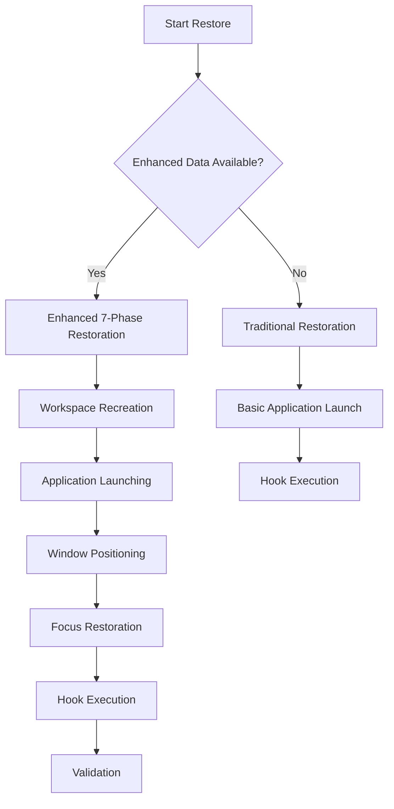

# Workspace-Based Session Management User Guide

## Overview

This guide provides comprehensive information about the enhanced workspace-based save and restore functionality in the Hyprland Session Manager. Learn how to leverage advanced workspace persistence features for a seamless desktop experience.

## 🎯 What is Workspace-Based Session Management?

Workspace-based session management extends the traditional session saving by preserving your complete workspace layouts, window arrangements, and application assignments across system reboots.

### Key Benefits

- **🔁 Perfect Workspace Recreation**: Return to your exact workspace configurations
- **🎯 Window Position Accuracy**: Applications restore to their precise positions and sizes
- **🚀 Context-Aware Launching**: Applications automatically open in correct workspaces
- **🎯 Focus Preservation**: Return to the workspace you were actively using
- **🔄 Seamless Integration**: Works automatically with existing setups

## 🚀 Getting Started with Enhanced Features

### Automatic Feature Detection

The system automatically detects and uses enhanced workspace data when available. No manual configuration is required!

```bash
# Save session with enhanced workspace data
~/.config/hyprland-session-manager/session-manager.sh save

# Restore session - automatically uses enhanced features when available
~/.config/hyprland-session-manager/session-manager.sh restore
```

### Enhanced Session Data Files

When enhanced features are available, the system creates comprehensive session files:

- **`workspace_layouts.json`**: Complete workspace configurations and structures
- **`window_states.json`**: Detailed window positions, sizes, and state information  
- **`application_workspace_mapping.json`**: Intelligent application-to-workspace assignments

## 📋 Enhanced Session Workflow

### Save Process

1. **Workspace Layout Capture**: Extracts complete workspace configurations
2. **Window State Capture**: Saves detailed window positions and states
3. **Application Mapping**: Creates intelligent workspace assignments
4. **Hook Execution**: Runs application-specific pre-save hooks
5. **Data Serialization**: Saves enhanced session data

### Restore Process

The system automatically chooses the appropriate restoration method:



## 🎯 Enhanced 7-Phase Restoration

### Phase 1: Workspace Recreation
- Recreates all workspaces with original names
- Maintains workspace IDs and monitor assignments
- Preserves workspace-specific configurations

### Phase 2: Workspace-Aware Application Launching
- Launches applications directly to assigned workspaces
- Uses intelligent workspace targeting
- Handles application-specific launch requirements

### Phase 3: Application Initialization Wait
- Allows applications to fully initialize
- Ensures windows are ready for positioning
- Prevents race conditions

### Phase 4: Window Positioning
- Restores windows to exact positions and sizes
- Maintains window states (floating, fullscreen, pinned)
- Handles multi-monitor configurations

### Phase 5: Workspace Focus Restoration
- Returns focus to previously active workspace
- Maintains user context and workflow
- Ensures seamless user experience

### Phase 6: Post-Restore Hooks
- Executes application-specific restoration
- Handles application state recovery
- Maintains backward compatibility

### Phase 7: Validation
- Verifies restoration success
- Logs comprehensive results
- Provides user feedback

## 🔧 Configuration and Customization

### Workspace Assignment Behavior

Applications are automatically assigned to workspaces based on their previous locations. The system handles:

- **Direct Workspace Launching**: Applications launch directly to target workspaces
- **Workspace Switching Fallback**: Fallback method for applications that don't support direct launching
- **Workspace Validation**: Ensures target workspaces exist before launching

### Performance Optimization

The system includes intelligent performance optimizations:

- **Staggered Application Launching**: Prevents system overload
- **Timeout Handling**: Manages slow-starting applications
- **Incremental Restoration**: Gradual workspace creation for smooth user experience

## 📊 Real-World Use Cases

### Development Workflow
```
Workspace 1: VSCode with project files
Workspace 2: Terminal sessions and development tools
Workspace 3: Browser with documentation and testing
Workspace 4: Communication apps (Discord, Slack)
```

### Creative Work
```
Workspace 1: Krita with active project
Workspace 2: Reference images and inspiration
Workspace 3: File manager and asset organization
Workspace 4: Communication and project management
```

### Office Setup
```
Workspace 1: LibreOffice documents
Workspace 2: Browser with research and email
Workspace 3: File manager and document organization
Workspace 4: Calendar and communication tools
```

## 🛠️ Troubleshooting

### Common Issues and Solutions

**Applications not restoring to correct workspaces:**
- Verify enhanced session data exists
- Check application window class names
- Ensure applications support workspace launching

**Workspace recreation issues:**
- Check Hyprland workspace creation permissions
- Verify workspace ID conflicts don't exist
- Ensure sufficient system resources

**Partial restoration:**
- Check for application launch timeouts
- Verify window positioning permissions
- Review restoration logs for specific errors

### Enhanced Session Data Verification

```bash
# Check for enhanced session files
ls -la ~/.config/hyprland-session-manager/session-state/

# Verify workspace data integrity
jq '.' ~/.config/hyprland-session-manager/session-state/workspace_layouts.json

# Check application mappings
jq '.' ~/.config/hyprland-session-manager/session-state/application_workspace_mapping.json
```

### Debug Mode

Enable detailed logging for workspace restoration:

```bash
export HYPRLAND_SESSION_DEBUG=1
~/.config/hyprland-session-manager/session-manager.sh save
~/.config/hyprland-session-manager/session-manager.sh restore
```

Check restoration logs for workspace recreation phases and application workspace assignments.

## 🔄 Backward Compatibility

### Automatic Fallback Behavior

The system maintains full backward compatibility:

- **Enhanced Data Detection**: Automatically detects and uses enhanced session data
- **Graceful Degradation**: Falls back to traditional restoration when enhanced data is unavailable
- **No Breaking Changes**: Existing setups continue working without modification

### Migration Path

Existing users automatically benefit from enhanced features:

1. **First Enhanced Save**: System captures workspace data alongside traditional data
2. **Subsequent Restores**: System automatically uses enhanced data when available
3. **Seamless Transition**: No user intervention required

## 📈 Performance and Reliability

### Restoration Performance

Typical restoration times for enhanced features:

- **Workspace Recreation**: 2-5 seconds
- **Application Launching**: 10-20 seconds (depending on number of applications)
- **Window Positioning**: 3-8 seconds
- **Total Enhanced Restoration**: 15-35 seconds

### Reliability Features

- **Error Handling**: Comprehensive error handling at each restoration phase
- **Validation**: Multi-stage validation of restoration success
- **Fallback Mechanisms**: Automatic fallback to traditional restoration
- **Logging**: Detailed logging for troubleshooting and monitoring

## 🤝 Community and Support

### Getting Help

- Check the main [README.md](README.md) for general information
- Review [troubleshooting section](#-troubleshooting) for common issues
- Examine session logs in `~/.config/hyprland-session-manager/session-state/`

### Contributing

Want to improve workspace restoration? See:
- [CONTRIBUTING.md](CONTRIBUTING.md) for contribution guidelines
- [workspace-restoration-hooks-guide.md](workspace-restoration-hooks-guide.md) for hook development
- Community hooks directory for examples

## 🎉 Conclusion

Workspace-based session management provides a significant enhancement to the Hyprland Session Manager, offering perfect desktop persistence across system reboots. The system automatically detects and uses enhanced features while maintaining full backward compatibility with existing setups.

Enjoy your seamless workspace restoration experience! 🚀